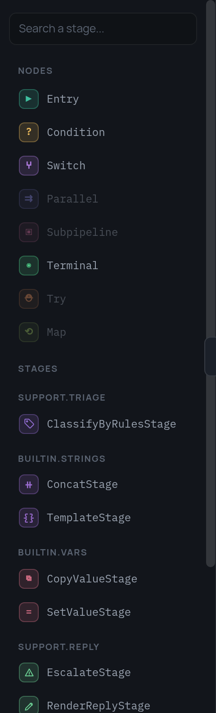

# 1. Ваши стадии

Стадия — единственное место в StageFlow, где выполняется ваш код. Всё
остальное — ветвления, циклы, обработка ошибок, фрейм — забота графа, а граф
это JSON, который вполне мог нарисовать кто-то другой.

```python
from stageflow import BaseStage, register_stage

@register_stage("LoadTicketStage")
class LoadTicketStage(BaseStage):
    """
    description: "Берёт готовый тикет из data/tickets.json"
    icon: "/icons/ticket.svg"
    category: "support.data"
    arguments:
      ticket_id:
        type: string
        optional: true
        description: "Номер тикета (T-1001); пусто — первый в файле"
    outputs:
      text:
        type: string
        description: "Сообщение клиента"
      customer_id:
        type: string
        description: "Кто написал"
    """

    async def run(self):
        wanted = (self.get_arguments().get("ticket_id") or "").strip()
        ...
        self.set_outputs({"text": ticket["text"], "customer_id": ticket["customer_id"]})
```

Докстринг здесь — не документация, которую заодно разбирают парсером. Это и
есть спецификация: по ней редактор рисует карточку — имя, иконку, цвет, какие
у узла порты и зачем каждый из них. Полная грамматика описана в
[Спецификации стадии](../stage-specification.ru.md); здесь важно другое —
записать это больше негде, поэтому оно физически не может разойтись с кодом.

{ width="240" }

## Маленькие и об одном

Стадии в примере намеренно крошечные: загрузить тикет, определить тему,
поискать в базе знаний, собрать ответ, отправить, эскалировать. И дело тут
не в любви к порядку. **Узел на холсте — это стадия**, и стадия,
которая и ищет что-то, и решает, что с найденным делать, превращается в узел,
о смысле которого приходится догадываться по названию. Решениям место в
графе — в `condition` или `switch`, где их видно и где с ними можно спорить.

Проверить легко: если в описании стадии не обойтись без союза «и», перед вами
две стадии.

## Аргументы приходят из фрейма

Стадия никогда не читает фрейм сама. Ей передают аргументы, а откуда их взять
— решает граф:

```json
{
  "id": "classify",
  "type": "stage",
  "stage": "ClassifyByRulesStage",
  "arguments": {"vars": {"text": "text", "subject": "subject"}},
  "outputs": {"topic": "topic", "urgency": "urgency"},
  "next": "search"
}
```

`arguments.vars` связывает имя аргумента с переменной фрейма,
`arguments.const` — со значением прямо из JSON, а ключ с точкой на конце
превращает значение в [CEL-выражение](../expressions.ru.md). `outputs`
работает в обратную сторону. Стадия получает обычный словарь и возвращает
обычный словарь — поэтому её можно тестировать вообще без пайплайна, и
поэтому же одна и та же стадия может стоять в графе дважды и читать при этом
разные переменные.

## Из ошибок получаются развилки

Упавшая стадия сообщает графу, что именно случилось, а граф решает, куда
идти дальше. Работает это, только если исключения можно различить:

```python
class LlmAuthError(RuntimeError):      # ключа нет — уходим на правила
class LlmRateLimited(RuntimeError):    # 429 — поможет повтор с паузой
class LlmUnavailable(RuntimeError):    # 5xx — повтор тоже поможет
class LlmBadAnswer(RuntimeError):      # модель ответила не то
```

Четыре класса, а не один, потому что в графе это четыре разные дороги:
`retry` на двух временных сбоях; `except`, уводящий на поиск по ключевым
словам, если ключа нет; отдельная концовка для испорченного ответа. Один голый
`Exception` не оставил бы автору пайплайна ничего, на чём ветвиться, — см.
[Ошибки и повторы](../errors.ru.md).

## События и потоковый текст

Стадия может отправлять события, и они попадают в лог редактора прямо по ходу
прогона:

```python
allowed_events = [
    EventSpec("reply_sent", "Ответ ушёл клиенту",
              payload_schema={"ticket_id": str, "channel": str, "chars": int}),
]

self.emit("reply_sent", {"ticket_id": ticket_id, "channel": "email", "chars": len(reply)})
```

Три строки объявления стоят того: необъявленный тип отклоняется, так что
опечатка в названии события всплывёт сразу, а не превратится в событие,
которого никто не ждёт.

Одна форма payload — это уже не соглашение, а контракт. Всё, в чём есть
`{"stream": true, "text": "…"}`, редактор считает куском текста, который узел
пишет прямо сейчас, и выводит в отдельной колонке отладочной панели по мере
поступления:

```python
for word in reply.split(" "):
    self.emit("reply_chunk", {"stream": True, "text": word + " ", "label": "Reply"})
```

Никаких знаний про ботов поддержки и языковые модели у редактора при этом
нет — он опознаёт форму payload, и только её. Стадия расшифровки речи или
стадия, показывающая лог сборки, получат ровно то же поведение, ничего для
этого не делая, а `label` задаёт заголовок колонки.

## Регистрация

`register_stage` кладёт класс в реестр, **общий на весь процесс**, — именно
поэтому и возможны `get_stages()`, а за ними и `/api/stages`:

```python
# app/stages/__init__.py
from . import support, llm  # noqa: F401 - сам импорт их и регистрирует
```

«Общий на весь процесс» — это и есть то самое, о чём предупреждало
[вступление](index.ru.md): любая стадия, которую процесс импортировал,
доступна любому пайплайну внутри него. Пока пайплайны пишете вы — не
страшно. Страшно становится ровно тогда, когда их пишет кто-то другой, и об
этом [шаг 3](3-policy.ru.md).

---

Дальше: [эндпоинты](2-endpoints.ru.md) — как редактор до всего этого
доберётся.
