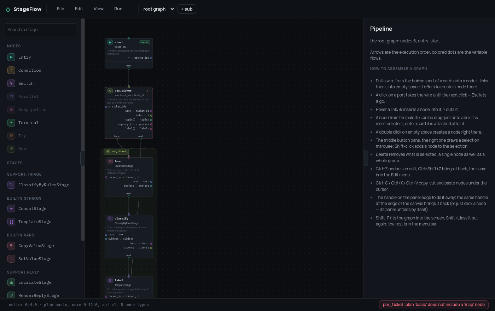

# 3. Что разрешено собирать

Вернёмся к фразе из [шага 1](1-stages.ru.md), теперь уже с последствием:
`register_stage` кладёт класс в реестр, общий на весь процесс, а значит любая
импортированная стадия доступна любому пайплайну внутри него.

Пока пайплайны ваши — это удобно. Как только они не ваши, это дыра. А
«разработчик задаёт блоки, а собирает из них кто-то менее доверенный» — ровно
та схема, ради которой StageFlow и существует. Без дополнительной защиты
`ChargeCardStage` доступна любому JSON, который кто угодно отправил в
`/api/run`.

Такая защита — [`Policy`](../policy.ru.md). Её задаёт хост; из пайплайна её
нельзя ни прочитать, ни тем более расширить.

```python
from stageflow import Limits, Policy

BASIC = Policy(
    stages={"LoadTicketStage", "ClassifyByRulesStage", "SearchKnowledgeStage",
            "RenderReplyStage", "SendReplyStage", "EscalateStage",
            "SetValueStage", "ConcatStage", "TemplateStage"},
    node_types={"entry", "stage", "condition", "switch", "terminal"},
    limits=Limits(
        counters={"seconds": 15, "steps": 200, "kb_lookups": 20, "replies_sent": 1},
        gauges={"concurrency": 2, "depth": 2, "frame_bytes": 200_000},
        max_retries=2, max_delay_seconds=2,
    ),
)
```

Три поля, и `None` в любом из них означает «ограничений нет» — это не то же
самое, что пустое множество: `Policy()` разрешает всё, а
`Policy(stages=set())` не разрешает ни одной стадии.

## Два рубежа, один и тот же ответ

```python
pipeline.validate(policy)                       # до: весь граф целиком
Session(id=..., pipeline=..., policy=policy)    # во время: каждый узел, когда до него дошли
```

Валидация нужна человеку: она перечисляет все проблемы разом, чтобы граф
можно было починить, а не выяснять по одной ошибке за прогон. Проверка в
рантайме — то, что держит защиту на самом деле, потому что граф может попасть
в сессию, вообще не пройдя валидацию. Одно другое не заменяет, а формулировки
ошибок в обоих случаях одинаковые.

В примере валидация стоит прямо в обработчике запроса, ещё до запуска потока:

```python
def start(self, payload: dict, policy: Policy) -> Run:
    pipeline = Pipeline.from_dict(payload.get("pipeline") or {})
    pipeline.validate(policy)      # отказ придёт ответом на POST, а не через минуту из потока
    ...
    session = Session(..., policy=policy)
```

## Предупредить редактор, чтобы он предупредил автора

Про политику, о которой редактор не знает, автор узнаёт только из отказа.
Поэтому оба читающих эндпоинта сужены ею:

```python
@router.get("/stages")
async def stages(caller: CallerPlan) -> dict:
    policy = policy_for(caller)
    return {"stages": {name: cls.get_specs()
                       for name, cls in get_stages().items()
                       if policy.allows_stage(name)}}


@router.get("/meta")
async def meta(caller: CallerPlan) -> dict:
    policy = policy_for(caller)
    return {"api": 1, "plan": caller, **capabilities(policy), "limits": _limits_of(policy)}
```

Отдать спецификацию запрещённой стадии — значит заставить редактор нарисовать
её в палитре, а прогон потом её отвергнуть. Ради устранения такого
расхождения политику и завели — а здесь оно воспроизводится на один эндпоинт
позже. `capabilities(policy)` делает то же самое для типов узлов.

Вот что это даёт на дешёвом тарифе из примера, если открыть пайплайн,
которому нужен `map`:



Четыре типа узлов в палитре погашены, на проблемном узле стоит метка, а
в строке состояния написано
`per_ticket: plan 'basic' does not include a 'map' node` — и всё это до того,
как кто-нибудь нажал «Run».

## Что валидация проверяет, а что отказывается угадывать

Из `limits` статическая валидация берёт только то, что **достоверно следует
из JSON**:

| Что проверяется | Почему это честно |
|---|---|
| кратчайший путь по графу сверяется с `steps` | любой прогон проходит не меньше узлов, так что граф, у которого даже самая короткая дорога не влезает, не завершится вообще никогда |
| глубина вложенности объявленных субпайплайнов — с `depth` | вложенность записана в JSON, её не нужно вычислять |
| то, что запрашивает каждый `retry`, — с `max_retries` и `max_delay_seconds` | эти числа тоже лежат в JSON |

Стоимости цикла в списке нет и не будет: число проходов берётся из данных, а
стоимость прохода — из его аргументов. Любое умножение здесь отвергало бы
работоспособные графы, а ложный отказ рабочему графу хуже того потолка, ради
которого его вводили.

## Потолок жёсткий

`BudgetExceeded` унаследован от **`BaseException`** и намеренно стоит вне
иерархии `StageFlowError`. Блоки `try` ловят `Exception`, механизм `retry` —
тоже, и если бы отказ по бюджету можно было поймать, любой тариф превращался
бы в украшение: достаточно обернуть граф в `try`. Ловит его ровно одно место,
`Session.run`, и завершает прогон так же, как это делает `stop`:

```python
result.result   # {"status": "budget_exceeded", "meter": "kb_lookups", "limit": 20, "spent": 21}
result.meters   # всё израсходованное — по нему и выставляется счёт
```

---

Дальше: [во что обходится прогон](4-metering.ru.md) — откуда в этих
счётчиках берутся числа.
