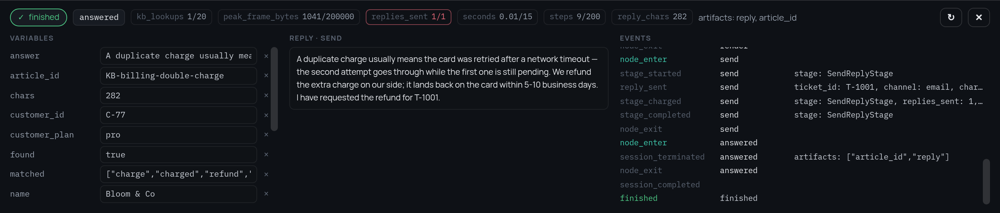

# 4. Во что обходится прогон

[Шаг 3](3-policy.ru.md) расставил потолки в политике. Этот шаг — про числа,
которые к ним подбираются. И первое, что стоит сказать: большинство стадий не
должны давать в эти числа ничего.

Чтение JSON-файла не стоит платформе ничего, что имело бы смысл считать.
Счётчик, который никому не нужен, — это лишнее число на экране, и ядро с этим
согласно: **что не ограничено, то и не измеряется**. Поэтому хосту, который
ничего не ограничивает, весь механизм стоит одной проверки `if`. Стадия,
которая ничего не объявила, бесплатна, и в примере таких большинство.

Расходы считают всего три стадии бота, а две, которые обращаются к модели,
вдобавок ещё и резервируют. Вместе они показывают все варианты, какие тут
бывают.

## Начисление: сколько ушло на самом деле

```python
class SearchKnowledgeStage(BaseStage):
    async def run(self):
        ...
        self.charge(kb_lookups=1)
        self.set_outputs({...})


class SendReplyStage(BaseStage):
    async def run(self):
        ...
        self.charge(replies_sent=1, reply_chars=len(reply))
```

`charge()` сообщает **единицы, а не деньги**. Сколько стоит единица — вопрос
прайс-листа; прайс-листы меняются без единой правки в коде и принадлежат
хосту. Стадия знает, сколько израсходовала, но не знает, во что это обошлось.

Названия придумываете вы. `kb_lookups`, `replies_sent`, `escalations` — это
единицы *конкретно этого* бизнеса, и ядро не фиксирует ни одного из них. Оно
фиксирует `steps`, `seconds`, `iterations` и пиковые счётчики только потому,
что больше их посчитать некому. Всё остальное — то, что в дефиците именно у
вас: записанные строки, отправленные сообщения, минуты аудио, время живого
человека.

Счётчик, на который никто не поставил ограничение, всё равно копится и всё
равно приезжает в `result.meters`, — так что можно сначала померить, а решать
про потолки потом.

## Резерв: за что нельзя даже браться

```python
class LlmReplyStage(BaseStage):
    """
    description: "Пишет ответ по статье базы знаний — потоком"
    timeout: 90
    reserve:
      llm_calls: 1
      tokens: "(size(args.text) + size(args.article)) / 4 + 600"
    """

    async def run(self):
        answer, usage = await self._chat(...)
        self.charge(llm_calls=1, tokens=usage.total_tokens)
```

Механизма два, и они не пересекаются:

| | Где живёт | Что видит | На какой вопрос отвечает |
|---|---|---|---|
| `reserve` | в спецификации, декларативно | `args` | стоит ли вообще пробовать |
| `charge()` | в коде стадии | всё, что стадия знает | сколько ушло в итоге |

`reserve` описан декларативно потому, что его читают **до** запуска: редактор
может показать «до 4000 токенов за вызов», а хост — отказать графу, ни разу
его не исполнив. Значения — либо числа, либо [CEL](../expressions.ru.md) по
`args`, то есть по аргументам в том виде, в каком их получит стадия.

Порядок такой: зарезервировали → выполнили → рассчитались.

1. резерв вычисляется и удерживается. Если он не влезает в остаток,
   **стадия даже не создаётся**: дорогой вызов лучше не начинать вовсе, чем
   обрывать на середине, когда деньги уже потрачены;
2. стадия работает;
3. `charge()` **вытесняет** резерв по тем счётчикам, которые назвал, и
   добавляет те, которых в резерве не было, — так что ничего не посчитается
   дважды. Стадия, которая ничего не начислила, рассчитывается по резерву — в
   том числе и упав: вызов, который ушёл и отвалился по таймауту, всё равно
   потратил то, что потратил.

Стадии, которые обращаются к модели, спрашивают настоящую цифру у провайдера —
на потоке для этого нужен `stream_options={"include_usage": True}`, потому что
usage приезжает последним чанком, в котором больше ничего нет, — а если шлюз
её не прислал, считают по четыре символа на токен. Про этот запасной вариант
стоит сказать вслух: начислить ноль означало бы тихо превратить потолок по
токенам в потолок ни по чему.

## Как это выглядит

Отладочная панель показывает, сколько прогон израсходовал и из чего, — и во
время прогона, и после него:



`kb_lookups 1/20`, `steps 9/200`, `seconds 0.01/15` — и красный
`replies_sent 1/1`, потому что этот тариф разрешает ровно один ответ за
прогон, и прогон его только что израсходовал. У `reply_chars 282`
знаменателя нет: его никто не ограничивает, поэтому он просто считается и
показывается. Событие `stage_charged` в логе справа — это и есть момент
расчёта.

## Цикл, который нельзя оценить заранее

Резерв берётся по стадиям, в момент запуска каждой. Во что обойдётся `map`
целиком, перед входом в цикл *не* считается: резерв итерации зависит от её
аргументов, аргументы — от элемента, а элемент приходит из данных.

Зато заранее можно проверить **количество итераций**, потому что список уже
на руках: `iterations` начисляется до первого прохода, поэтому цикл на тысячу
элементов на тарифе с полусотней отклоняется, не выполнив ни одного.

То есть цикл останавливается ровно тогда, когда не может оплатить очередную
стадию, а уже сделанные проходы к этому моменту оплачены. Если хосту нужен
жёсткий потолок на весь цикл, его даёт арифметика, а не предсказание:
ограничить `iterations` так, чтобы в бюджет влезал худший случай.

---

Дальше: [чей это запрос](5-tenants.ru.md) — как решается, какая из политик
вообще применяется.
