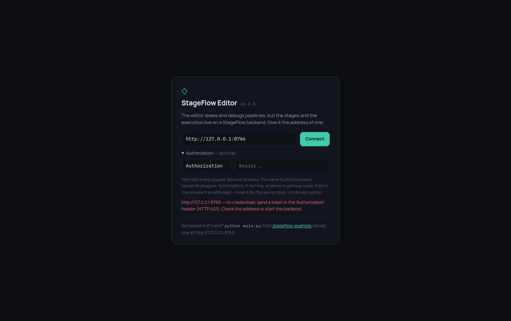
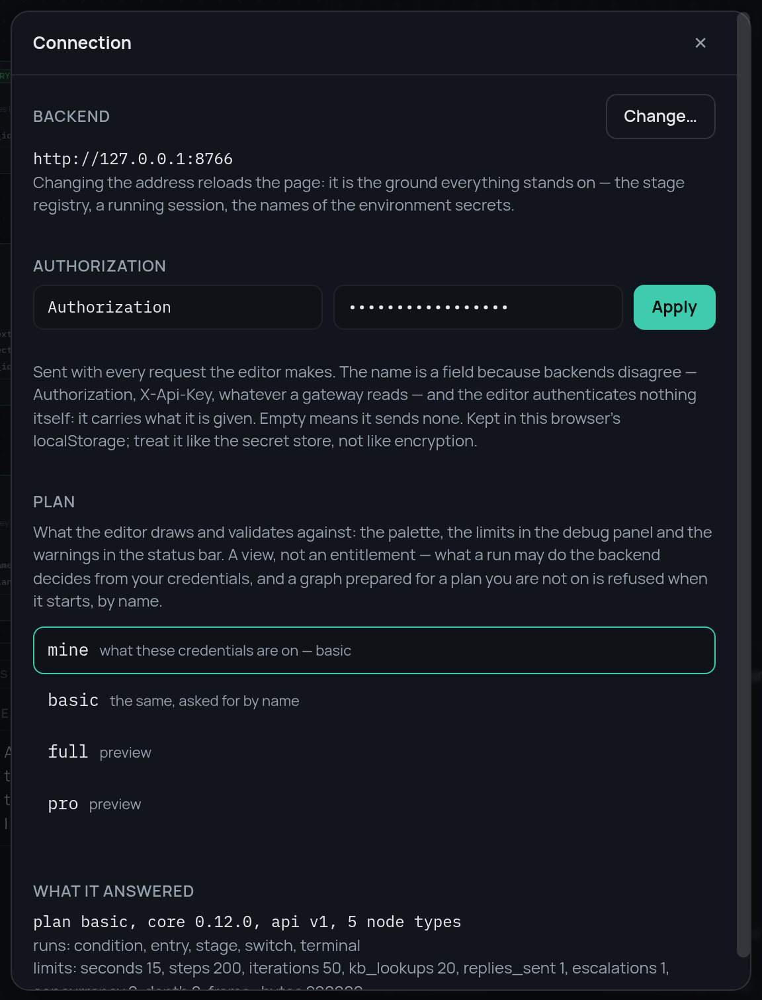

# 5. Чей это запрос

`Policy` — это объект. Превратить в него HTTP-запрос и есть последний шаг, и
именно про него у StageFlow намеренно нет своего мнения.

**Авторизации во фреймворке нет и не будет.** Ядро принимает готовую
политику; токены, заголовки, сессии, клиенты и подписки — это то, к чему у
каждой платформы уже есть свой подход, и подход фреймворка стал бы ещё одной
вещью, с которой приходится бороться. В примере на всё про всё уходит сорок
строк в `app/auth.py`, и настоящий бэкенд заменяет этот файл целиком, не
трогая больше ничего.

## Тарифы — это просто таблица

```python
PLANS: dict[str, Policy] = {
    "full":  Policy(),                     # пример без ограничений
    "basic": Policy(stages=RULES_ONLY | PLUMBING, node_types={...}, limits=...),
    "pro":   Policy(node_types=None, limits=Limits(counters={"tokens": 200_000, ...})),
}
```

Настоящая платформа найдёт клиента и соберёт политику из его подписки. Слова
«тариф», «basic» и «pro» — дело платформы, ровно как и прайс-лист, который
превращает `result.meters` в счёт.

Одно из примера стоит перенять в любом случае: **`basic` умеет что-то
запускать**. У него есть свой пайплайн, `06-rules-only.json`, — весь бот
целиком, но без единого обращения к модели. Тариф, на котором не работает
вообще ничего, — это не дешёвый тариф, а сломанный, и пользователя он учит
только тому, что продукт не работает.

## Решает ключ доступа

```python
AUTH_HEADER = os.environ.get("SF_AUTH_HEADER", "Authorization")
TOKENS = _parse_tokens(os.environ.get("SF_TOKENS", ""))   # "tok:plan,tok:plan"


def caller_plan(request: Request) -> str:
    if not TOKENS:                       # ничего не настроено: никого не различаем
        return OPEN_PLAN
    token = credential(request)
    if token is None:
        raise HTTPException(401, f"no credentials: send a token in the '{AUTH_HEADER}' header")
    plan = TOKENS.get(token)
    if plan is None:
        raise HTTPException(401, "the credentials were not recognised")
    return plan
```

**Название** заголовка вынесено в настройку, потому что бэкенды тут не
сходятся во мнениях: `Authorization: Bearer …`, `X-Api-Key: …`, что-нибудь,
что положил шлюз. Редактор такие вещи решать не должен. Если не настроено
ничего, никакой авторизации нет вовсе и пример просто запускается и
работает — в чём и смысл примера.

В редакторе это просто поле, и его значение проверяется тем же запросом, что и
адрес. Так что неправильный токен оказывается неправильным на том же экране,
где его можно исправить, а не на первом прогоне:



## Посмотреть тариф и работать на нём — разные вещи

Дальше идёт самая важная часть, потому что напрашивающееся здесь упрощение
разрушает всё, что построили два предыдущих шага.

Читающие эндпоинты принимают `?plan=` — **от кого угодно и без всякой
проверки**:

```python
@router.get("/meta")
async def meta(caller: CallerPlan, plan: ShownPlan = None) -> dict:
    shown = plan or caller
    policy = policy_for(shown)
    return {"api": 1, "plan": shown, "plan_source": source_of(plan),
            "plans": plan_names(), **capabilities(policy), "limits": _limits_of(policy)}
```

Название тарифа — не пропуск на него. Рисовать не значит запускать, а
редактор, которому нужно авторизоваться, прежде чем погасить кнопку в
палитре, никто настраивать не станет. Поэтому вопрос «а как этот граф
выглядел бы на тарифе подешевле» может задать кто угодно. `plans` — готовый
список названий, чтобы клиенту не пришлось хранить их у себя: знать их
заранее он не может.

А вот запуск такого параметра не принимает:

```python
@router.post("/run", status_code=201)
async def start_run(body: RunRequest, caller: CallerPlan) -> dict:
    if body.plan is not None and body.plan != caller:
        raise HTTPException(403, f"this graph was prepared for plan '{body.plan}', "
                                 f"and these credentials are on '{caller}'")
    run = runs.start(body.model_dump(), policy_for(caller))
```

`body.plan` едет в обратную сторону: это то, **под какой тариф граф
рисовали**, а не просьба на нём запуститься. Если его прислали, расхождение
можно назвать вслух — и это куда более полезный ответ, чем куча ошибок
валидации про отдельные стадии:


Прокиньте `?plan=` ещё и в запуск — одна строка, выглядит совершенно
безобидно — и каждый потолок из двух предыдущих шагов превратится в
query-параметр. В примере `check_pipelines.py` проверяет, что этого никто
не сделал: такое свойство ломается незаметно для любого теста эндпоинтов.

## Что из этого делает редактор

Всё это собрано в один диалог — «File» → «Connection…» или клик по строке
бэкенда в строке состояния:

{ width="520" }

В нём четыре вещи: адрес, ключ доступа, тариф, под который рисуем, и то, что
ответил бэкенд. Смена адреса перезагружает страницу — на адресе стоит вся
сессия. Ключ, наоборот, применяется на месте: токен протухает *посреди*
работы, а отвергнутый откатывается, чтобы сессия уцелела. `?plan=basic` в
адресе самого редактора открывает его сразу в нужном виде, а строка состояния
помечает предпросмотр как предпросмотр, чтобы его нельзя было принять за
реальные права.

## Где проходит граница

| | Фреймворк | Платформа |
|---|---|---|
| что может содержать граф | `Policy` | какая именно политика кому достанется |
| сколько прогон может потратить | `Limits`, счётчики, `BudgetExceeded` | сколько стоит единица |
| кто прислал запрос | — | целиком |
| месячная квота, очередь, пул | — | целиком |

Последняя строка важна не меньше остальных. `concurrency: 8` ограничивает
**один прогон**; сто прогонов — это восемьсот задач, а сколько прогонов
существует одновременно, ядро знать не может. Допуск к запуску — очередь,
пул на клиента, месячный бюджет — это дело платформы. Дело ядра — держать
потолок одного прогона и честно доложить, во что тот обошёлся.

---

Вот и весь бэкенд: [стадии](1-stages.ru.md), [эндпоинты](2-endpoints.ru.md),
[политика](3-policy.ru.md), [счётчики](4-metering.ru.md) и ключ доступа.
Готовое целиком лежит в
[stageflow-example](https://github.com/leo-need-more-coffee/stageflow-example)
— около шестисот строк на Python.
