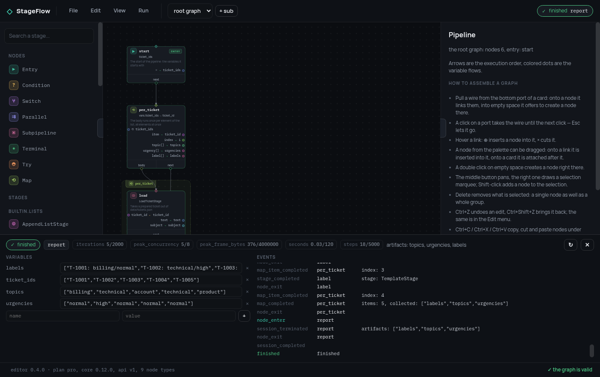

# Как собрать бэкенд

[Редактор](https://github.com/leo-need-more-coffee/stageflow-ui) рисует граф,
валидирует его и отлаживает — и не исполняет ничего. Всё, чего он не умеет
сам, он спрашивает у бэкенда, и бэкенд этот ваш, потому что стадии ваши: что
пайплайн вообще *может сделать* в вашем продукте, знает только ваш код.

Это разделение не про упаковку. Семантика исполнения — CEL, фрейм,
`try`/`except`, `parallel`, бюджет — живёт в ядре, и вторая её реализация на
JavaScript означала бы, что отладчик показывает не то, что происходит. Поэтому
реализация одна, редактор — её клиент, а между ними HTTP-контракт из семи
эндпоинтов.

Этот трек собирает такой бэкенд. Это тот самый
[пример](https://github.com/leo-need-more-coffee/stageflow-example) из README
этого репозитория, разобранный в том порядке, в каком его писали: бот
поддержки, чьи стадии берут подготовленный тикет, ищут ответ в базе знаний и
либо пишут ответ, либо отдают тикет человеку.



## Шаги

| Шаг | Что добавляется | На что отвечает |
|---|---|---|
| [1. Ваши стадии](1-stages.md) | `register_stage`, спеки, события | что пайплайн здесь умеет |
| [2. Эндпоинты](2-endpoints.md) | FastAPI, настоящая `Session`, SSE | как редактор до этого доберётся |
| [3. Что можно собирать](3-policy.md) | `Policy` на вызывающего | что может нарисовать *менее доверенный* автор |
| [4. Во что обходится прогон](4-metering.md) | `reserve:` и `charge()` | сколько ему можно израсходовать |
| [5. Кто звонит](5-tenants.md) | тарифы и учётные данные | к кому что из перечисленного относится |

Первых двух хватает на собственный бэкенд. Последние три превращают его в
штуку, на которой можно дать собирать пайплайны кому-то ещё, — и читать их
стоит, даже если второго тенанта не будет никогда: «реестр стадий глобальный»
— это фраза с последствиями.

## Что понадобится

```bash
pip install "stageflow-framework>=0.12" fastapi uvicorn
```

Чтобы смотреть на готовое:

```bash
git clone https://github.com/leo-need-more-coffee/stageflow-example
cd stageflow-example && pip install -r requirements.txt && python main.py
```

и редактор на
[leo-need-more-coffee.github.io/stageflow-ui](https://leo-need-more-coffee.github.io/stageflow-ui/),
наведённый на `http://127.0.0.1:8765`. Каждый скриншот на этих страницах —
эта пара, запущенная локально.
