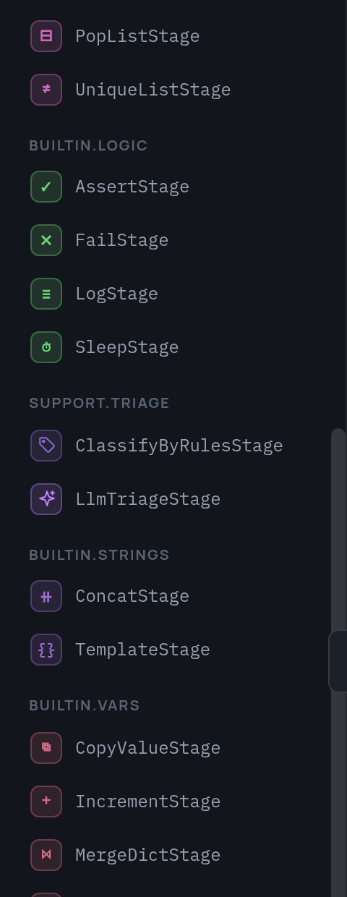

# Built-in stages

| Category | Stages |
|---|---|
| vars | `SetValueStage`, `CopyValueStage`, `IncrementStage`, `MergeDictStage` |
| lists | `AppendListStage`, `ExtendListStage`, `FilterListStage`, `UniqueListStage`, `PopListStage` |
| dicts | `PickKeysStage`, `DropKeysStage` |
| strings | `ConcatStage`, `TemplateStage` |
| logic | `AssertStage`, `FailStage`, `LogStage`, `SleepStage` |

All of them return new values and never mutate their input.

They arrive in the editor's palette together with your own stages, grouped by
category:

{ width="240" }

