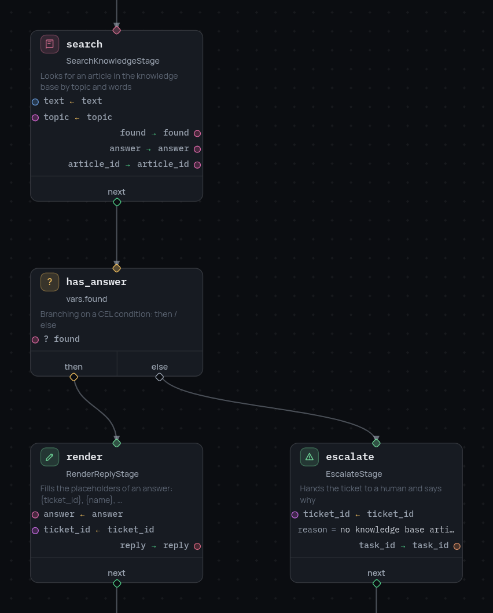
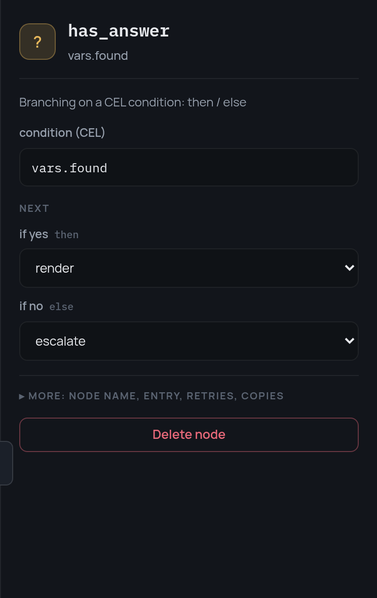

# The condition node

A fork in the road with two exits, decided by a [CEL expression](expressions.md)
over the frame.

```json
{
  "id": "confident",
  "type": "condition",
  "condition": "vars.score > 0.7 && vars.topic != 'billing'",
  "then": "answer",
  "else": "escalate"
}
```

{ width="426" }

- The expression is evaluated against the current frame and taken as a
  boolean, so an empty string, `0` and an empty list send execution down
  `else` as surely as `false` does.
- `then` is required. `else` is not.
- The node writes nothing to the frame — it only chooses. To carry a computed
  value onwards, write it with a stage before the fork, or with `expose`.
- The `condition_evaluated` event records what was decided:
  `{"result": true, "next": "answer"}`.

In the editor the variables the expression reads become data ports of the
card, so a condition is not a black box on the canvas:

{ width="372" }

## When the road ends

If the condition is false and there is no `else`, there is nowhere to go and
the run simply ends: no [`terminal`](terminal-node.md) was reached, so the
session returns `result = null` and no artifacts.

That is occasionally what is wanted — "nothing more to do here" — but far more
often it is a forgotten branch. When the end of a road is deliberate, say so
with a `terminal`: the result then states which end it was.
