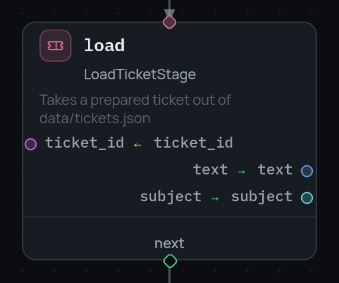
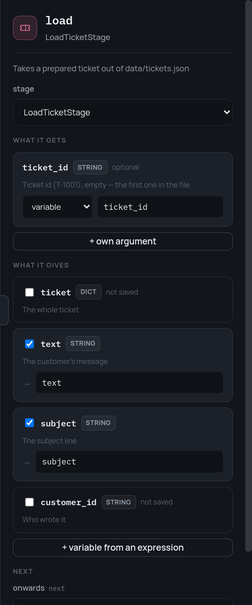

# Data model

Pipeline data is a single frame, `vars`, carried along the execution path.
The frame is immutable: every write produces a new one, so `parallel` branches
diverge independently and the same object can safely be handed to several
concurrent consumers. The only visibility boundary is `subpipeline`: a child
starts with a fresh frame and receives data through `inputs`.

A node's `arguments` are split into buckets: `vars` holds references to frame
variables, `const` holds literals. Buckets can be mixed in one node; on a name
collision the variable reference wins over the literal. A `stage` node has no
separate settings field — a literal setting is a `const` argument.

```json
{
  "id": "auth",
  "type": "stage",
  "stage": "AuthStage",
  "arguments": { "vars": { "creds": "creds" }, "const": { "timeout_s": 30 } },
  "outputs":   { "token": "token" },
  "consume": ["creds"],
  "next": "fetch"
}
```

In `outputs` the key is the name of a field in the stage result and the value
is the variable to store it in. A field the stage does not return is rejected
by `Pipeline.validate()` against the stage specification. If a stage declares
no outputs at all, the contract is considered undeclared and the check is
skipped.

A node's outputs are applied as a simultaneous assignment: values are computed
against the frame as it was on entry and only then written, so key order does
not affect the result.

On a card this is the two halves: above the divider what the node reads,
below it what it writes.

{ width="278" }

The panel on the right is the same node as a form, built from the stage
specification:

{ width="372" }

