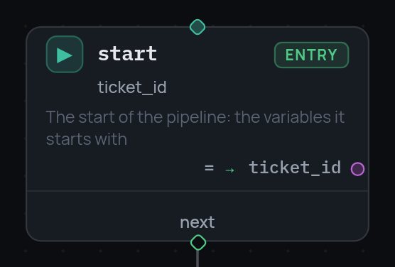

# The entry node

The graph starts at a node, not at a field in the JSON header, and that node
declares the pipeline's initial variables.

```json
{
  "id": "start",
  "type": "entry",
  "variables": {
    "n": 5,
    "items": [1, 2, 3],
    "total.$": "vars.n * 2"
  },
  "next": "check"
}
```

- A name already present in the frame (session seed, a parent's `inputs`) is
  neither overwritten nor evaluated.
- Variables are bound in dependency order: an expression may reference a
  sibling variable of the same node, key order in the JSON is irrelevant, and
  a cycle is a `validate()` error.
- There is exactly one `entry` node per graph and jumping back into it is
  forbidden. The pipeline-level `entry` field is optional when such a node
  exists, and must point at it when given.
- Value types are checked statically, during validation.

{ width="278" }

