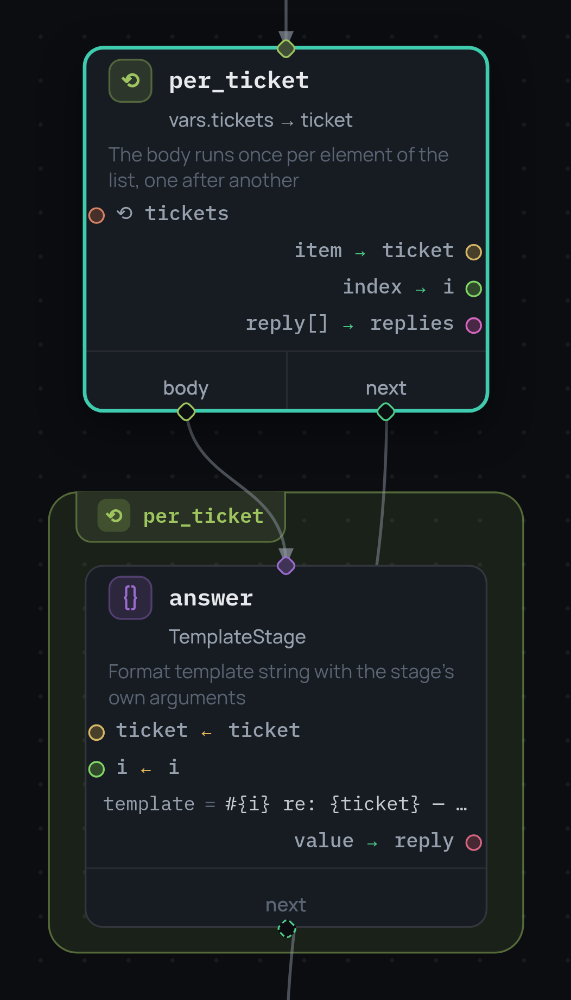
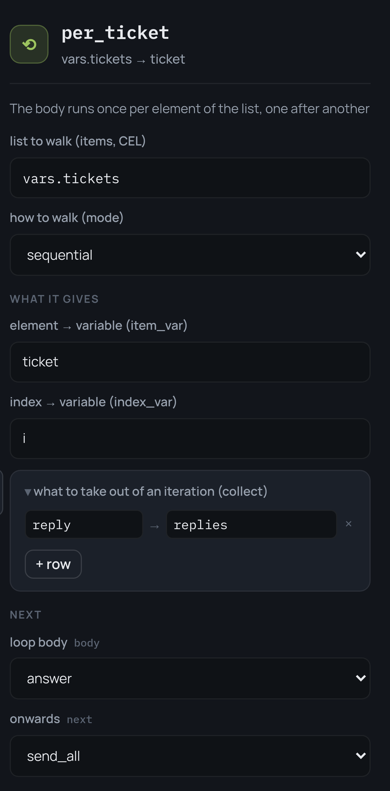

# Узел map

```json
{
  "id": "per_ticket",
  "type": "map",
  "items": "vars.tickets",
  "body": "classify",
  "item_var": "ticket",
  "index_var": "i",
  "collect": { "reply": "replies" },
  "mode": "sequential",
  "next": "send_all"
}
```

`map` исполняет одну область графа по разу на каждый элемент списка. Область —
это тело, и выводится оно ровно так же, как тело [блока `try`](errors.ru.md):
всё достижимое из `body` и недостижимое из `next`. Редактор обводит её рамкой
и показывает на карточке, что входит и что выходит:

{ width="340" }

## Что видит итерация

Каждая итерация стартует со своей копии фрейма — такого, каким он был на входе
в цикл, — где элемент связан с именем из `item_var` (по умолчанию `item`), а
при желании позиция с нуля — с именем из `index_var`. Поэтому итерации не
видят записей друг друга: то же правило, что у веток
[узла `parallel`](parallel-branches.ru.md), и именно поэтому оба режима ведут
себя одинаково.

## Что выходит наружу

Только `collect`. Имя, записанное внутри тела, становится снаружи списком — по
записи на элемент, **в порядке элементов**, а не в порядке завершения итераций
(что важно в режиме `parallel`):

```json
"collect": { "reply": "replies" }
```

читает `vars.reply` в конце каждой итерации и оставляет снаружи
`vars.replies == [reply₀, reply₁, …]`. Список — сокращение для «оставить имя
как есть»: `"collect": ["reply"]`. Итерация, которая имя не записала, роняет
узел с `StageOutputError` — дырка посреди собранного списка никогда не то, что
имелось в виду. Пустой `items` собирает пустой список и сразу уходит в `next`.

Объявленные типы проверяются на выходе: если `replies` объявлена, собранный
список сверяется с объявлением до записи во фрейм.

Панель — тот же JSON словами: список, темп, имена, под которыми приходят
элемент и индекс, и таблица того, что собирать:

{ width="372" }

## Последовательно и параллельно

`mode` — `sequential` (по умолчанию) или `parallel`. `cancel_on_error` (по
умолчанию `true`) решает судьбу оставшихся элементов при падении одного:
`true` останавливается на первом упавшем — в параллельном режиме отменяя ещё
работающие итерации, с событием `map_cancelled`, — а `false` даёт доиграть
всем элементам, после чего узел падает с ошибкой самого раннего упавшего.

Ошибка поднимается **как есть**, без обёртки: блок `try` вокруг `map`,
настроенный на `ValueError`, поймает тот `ValueError`, который бросило тело.
Индекс элемента — в событии `map_item_failed`.

`retry` на самом узле map повторяет цикл целиком, а не упавший элемент: это
свойство узла, как и везде.

## Тело должно быть замкнуто

Любая дорога внутри тела обязана заканчиваться внутри него. Дорога наружу —
ошибка валидации:

```
per_ticket: 'classify' leads to 'send_all', outside the loop body;
a road inside the body must end inside it
```

Блок `try` дорогу наружу допускает — он просто перестаёт ею владеть. Цикл так
не может: уход посреди третьего элемента бросил бы оставшиеся, а в
параллельном режиме не нашлось бы единственного фрейма, с которым продолжать.
`terminal` внутри тела по-прежнему разрешён и завершает весь прогон, как и
везде.

## События

| Событие | Полезная нагрузка |
|---|---|
| `map_started` | `items`, `mode`, `body` |
| `map_item_started`, `map_item_completed` | `index` |
| `map_item_failed` | `index`, `error`, `type` |
| `map_cancelled` | `items` — отменённые индексы |
| `map_completed` | `items`, `collected` |
