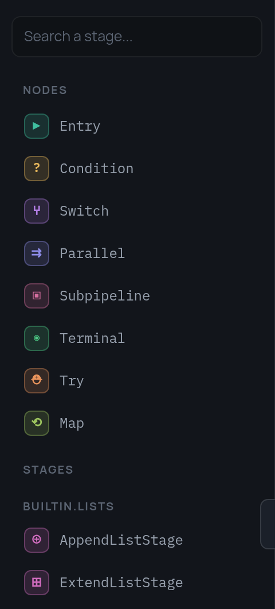

# Типы узлов

| `type` | Назначение | Ключевые поля |
|---|---|---|
| [`entry`](entry-node.ru.md) | начало графа и переменные старта | `variables`, `next` |
| [`stage`](stage-node.ru.md) | исполнение зарегистрированной стадии | `stage`, `arguments`, `outputs`, `consume`, `next` |
| [`condition`](condition-node.ru.md) | бинарное ветвление по CEL | `condition`, `then`, `else` |
| [`switch`](switch-node.ru.md) | n-way ветвление, первый истинный case | `cases: [{when, next}]`, `default` |
| [`parallel`](parallel-branches.ru.md) | конкурентные ветки с независимыми фреймами | `branches`, `cancel_on_error`, `next` |
| [`try`](try-node.ru.md) | блочная обработка ошибок области графа | `body`, `except`, `next` |
| [`map`](map-node.ru.md) | область графа, исполняемая по разу на элемент списка | `items`, `body`, `item_var`, `collect`, `mode`, `next` |
| [`subpipeline`](subpipeline-node.ru.md) | вложенный пайплайн со свежим фреймом | `subpipeline_id`, `inputs`, `artifact_outputs`, `result_output`, `next` |
| [`terminal`](terminal-node.ru.md) | конец исполнения | `result`, `artifacts` |

Любому узлу дополнительно доступны `retry`, `consume` (убрать имена из фрейма
после шага) и `expose` (копирование или переименование переменной без стадии).

В [редакторе](tutorial/7-debugger.ru.md) типы узлов — это верх палитры, а ниже
идут стадии, которые знает бэкенд.

{ width="240" }
