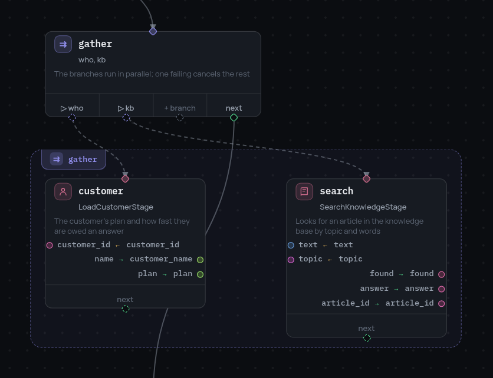

# Parallel branches

```json
{
  "id": "fan_out",
  "type": "parallel",
  "branches": [{ "id": "hash", "entry": "hash_step" },
               { "id": "thumb", "entry": "thumb_step" }],
  "next": "merge"
}
```

Only names that were not in the frame before `parallel` leave a branch; a
write to a name that existed on entry stays branch-local. Such names are
listed in the `parallel_completed` event:
`{"merged": ["fresh"], "dropped": ["left.n"]}`. Two branches writing the same
name raise `BranchError` naming both.

`cancel_on_error` (default `true`) decides the fate of sibling branches when
one fails: `true` cancels them immediately (the `parallel_cancelled` event),
`false` lets them finish. Either way the node fails with the error of the
first branch that failed.

The editor draws the branches as a framed region under the node:

{ width="418" }

