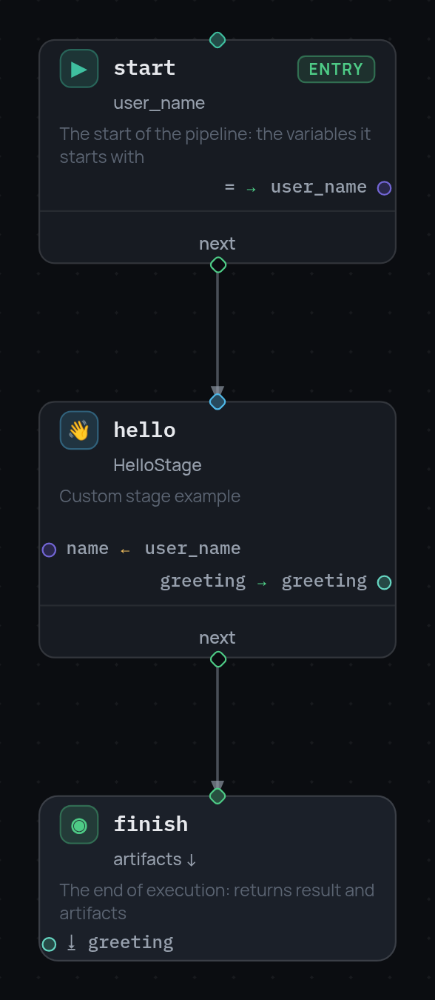

# Quick start

## Installation

```bash
pip install stageflow-framework
```

From a checkout, for development:

```bash
python -m venv .venv
source .venv/bin/activate
pip install -e ".[dev]"
```

## Writing a stage

Register a stage:

```python
from stageflow import BaseStage, register_stage

@register_stage("HelloStage")
class HelloStage(BaseStage):
    """
    description: "Custom stage example"
    icon: "👋"
    arguments:
      name: string
    outputs:
      greeting: string
    """
    async def run(self):
        name = self.get_arguments().get("name", "world")
        self.set_outputs({"greeting": f"Hello, {name}!"})
```

## Describing a pipeline


```python
pipeline_dict = {
    "nodes": [
        {
            "id": "start",
            "type": "entry",
            "variables": {"user_name": "Alice"},
            "next": "hello",
        },
        {
            "id": "hello",
            "type": "stage",
            "stage": "HelloStage",
            "arguments": {"vars": {"name": "user_name"}},
            "outputs": {"greeting": "greeting"},
            "next": "finish",
        },
        {
            "id": "finish",
            "type": "terminal",
            "result": {"status": "ok"},
            "artifacts": ["greeting"],
        },
    ],
}
```

## In the editor

The pipeline above, opened in the [editor](tutorial/7-debugger.md) against a
backend that has `HelloStage` registered:

{ width="294" }

## Running it


```python
import asyncio
from stageflow import Pipeline, Session

async def main():
    session = Session(id="demo", pipeline=Pipeline.from_dict(pipeline_dict))
    result = await session.run()
    print(result.result)     # {'status': 'ok'}
    print(result.artifacts)  # {'greeting': 'Hello, Alice!'}

asyncio.run(main())
```

Values declared by the `entry` node are defaults: anything supplied from the
outside overrides them, so the same pipeline can be parameterised without
editing its JSON.

```python
from stageflow import Context
session = Session(id="demo", pipeline=pipeline, context=Context({"user_name": "Bob"}))
```
