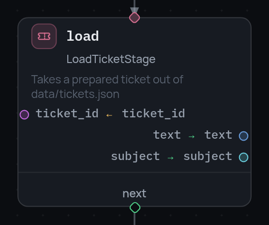

# Узел stage

Единственный узел, который делает работу. Все остальные решают, куда идти, а
`stage` исполняет зарегистрированную стадию и кладёт во фрейм то, что она
вернула.

```json
{
  "id": "greet",
  "type": "stage",
  "stage": "TemplateStage",
  "arguments": {
    "const": { "template": "Hello, {name}! You have {count} tickets." },
    "vars": { "name": "user", "count": "open_tickets" }
  },
  "outputs": { "value": "greeting" },
  "consume": ["user"],
  "next": "done"
}
```

{ width="278" }

## Аргументы: два бакета

Стадия никогда не лезет во фрейм сама — она только получает аргументы. Оба
бакета сводятся в один плоский набор именованных аргументов:

| Бакет | Что значит | Пример |
|---|---|---|
| `const` | литерал, записанный в пайплайне | `"template": "Hello, {name}!"` |
| `vars` | значение переменной фрейма | `"name": "user"` → в аргумент `name` придёт `vars.user` |

`vars` принимает и список, когда имя аргумента совпадает с именем переменной:
`"vars": ["ticket_id"]` — то же самое, что `"vars": {"ticket_id": "ticket_id"}`.

Ключ, оканчивающийся на `.$`, — это не значение, а
[CEL-выражение](expressions.ru.md), и работает он в любом из бакетов:

```json
"arguments": {
  "const": { "greeting.$": "'Hello, ' + vars.user" },
  "vars": { "total.$": "vars.a + vars.b" }
}
```

Аргумент называется без суффикса (`greeting`, `total`). В каком бакете лежит
выражение — неважно, решает именно суффикс.

## Выходы: что возвращается во фрейм

Возвращённое стадией становится пространством полей:

| Стадия вернула | Пространство |
|---|---|
| словарь | сам словарь |
| объект | его атрибуты (`vars(obj)`) |
| что угодно ещё | `{"value": …}` |
| `None` | пусто |

`outputs` связывает поле этого пространства с переменной — **сначала поле,
потом переменная**:

```json
"outputs": { "value": "greeting" }
```

Неявно не пишется ничего: поле, которое стадия вернула, а `outputs` не
упомянул, просто остаётся за бортом. Поле, которого `outputs` просит, а
стадия не вернула, — это `StageOutputError` с перечислением доступных:
падение в месте причины, а не загадочный `KeyError` через три узла.

Вычисляемый выход — зеркало вычисляемого аргумента: суффикс `.$` и место
назначения в ключе, выражение в значении, а возвращённое стадией видно в нём
как `output`:

```json
"outputs": { "loud.$": "output.value + '!'" }
```

## consume: убрать то, что больше не нужно

```json
"consume": ["user", "raw_html"]
```

Имена удаляются из фрейма после шага. Полезно для громоздкого значения,
которое было нужно только этой стадии — скачанной страницы, раскодированного
файла, — чтобы оно не тащилось по остальному графу и не попадало в снапшот
сессии.

## Что ловит валидация до запуска

`Pipeline.validate()` сверяет узел со
[спецификацией стадии](stage-specification.ru.md):

- неизвестное имя стадии;
- выходное поле, которого стадия не объявляет (`does not return field 'x'
  (available: [...])`) — если только в спеке не объявлена `*`;
- при включённой [типизации](variable-typing.ru.md) — аргумент, в который
  идёт переменная с несовместимым объявленным типом, и выход, записываемый в
  переменную не того типа.

`retry` и `expose` работают здесь так же, как на любом узле, — см.
[Ошибки](errors.ru.md) и [Типы узлов](node-types.ru.md).
