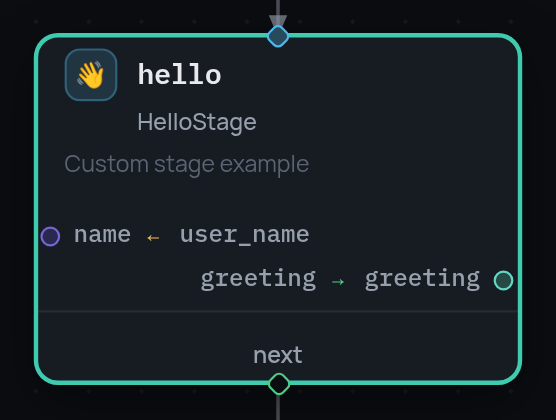

# Stage specification

A stage is specified by YAML in its docstring: `description`, `arguments`,
`outputs`, plus visual hints for the editor.

```yaml
description: "Increment numeric value by delta"
icon: "＋"          # glyph, SVG link, data URI or inline <svg> markup
icon_mono: false    # recolour the SVG to the node colour (monochrome sets)
color: "#ff8800"    # card accent (defaults to the category colour)
```

`icon` accepts four forms:

| Value | What gets drawn |
|---|---|
| `"＋"`, `"👋"` | the glyph or emoji itself |
| `"/icons/globe.svg"`, `"https://…/x.svg"` | an SVG by link |
| `"data:image/svg+xml;utf8,…"` | a data URI |
| `"<svg …>…</svg>"` | markup straight from the docstring |

`icon_mono: true` draws the SVG as a mask in the node colour, which suits
monochrome sets (lucide, feather, tabler) that paint via `currentColor`.
Without `icon` the editor draws a monogram of the stage name
(`IncrementStage` → `IS`); without `color` it picks a deterministic colour for
the category.

A stage may also declare `allowed_events` and `allowed_inputs` (`EventSpec` /
`InputSpec` with a `payload_schema`), a `category` and a `timeout`. All of it
ends up in `get_specs()`.

This is what the specification above turns into on the canvas: the icon, the
description, the arguments it reads and the outputs it writes.

{ width="278" }

