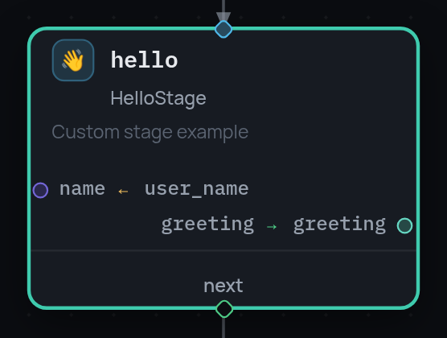

# Stage specification

A stage is specified by YAML in its docstring: `description`, `arguments`,
`outputs`, plus visual hints for the editor.

```yaml
description: "Increment numeric value by delta"
icon: "＋"          # glyph, SVG link, data URI or inline <svg> markup
icon_mono: false    # recolour the SVG to the node colour (monochrome sets)
color: "#ff8800"    # card accent (defaults to the category colour)
```

`icon` accepts four forms:

| Value | What gets drawn |
|---|---|
| `"＋"`, `"👋"` | the glyph or emoji itself |
| `"/icons/globe.svg"`, `"https://…/x.svg"` | an SVG by link |
| `"data:image/svg+xml;utf8,…"` | a data URI |
| `"<svg …>…</svg>"` | markup straight from the docstring |

`icon_mono: true` draws the SVG as a mask in the node colour, which suits
monochrome sets (lucide, feather, tabler) that paint via `currentColor`.
Without `icon` the editor draws a monogram of the stage name
(`IncrementStage` → `IS`); without `color` it picks a deterministic colour for
the category.

Four more things end up in `get_specs()`, and those are **class attributes,
not docstring keys**: `category`, `timeout`, `allowed_events` and
`allowed_inputs` (`EventSpec` / `InputSpec` with a `payload_schema`).

| In the docstring | On the class |
|---|---|
| `description`, `icon`, `icon_mono`, `color` | `category` |
| `arguments`, `outputs`, `reserve` | `timeout` |
| | `allowed_events`, `allowed_inputs` |

A `category:` or `timeout:` written in the docstring is parsed and then
dropped, and nothing warns. `get_specs()` reports the class attribute, so the
spec and the deadline the run enforces agree with each other and there is
nothing to notice: a stage that asks for `timeout: 90` in its docstring alone
runs under the `BaseStage` default of 30 seconds, and the editor is told 30 as
well.

## What it asks to reserve

`reserve` declares what a run of the stage may consume, in the
[meters](limits.md) the host counts. Values are numbers or CEL over `args`,
the arguments as the stage will receive them:

```yaml
reserve:
  llm_calls: 1
  tokens: "args.max_tokens + size(args.text) / 3"
```

It is declared rather than computed because it is read **before** the stage
runs: a host refuses a graph it cannot pay for without executing it, and an
editor can show the figure on the card. What was actually spent is reported
by the stage itself with `self.charge(...)`, which is code, because the truth
is only known at the end.

This is what the specification above turns into on the canvas: the icon, the
description, the arguments it reads and the outputs it writes.

{ width="278" }

