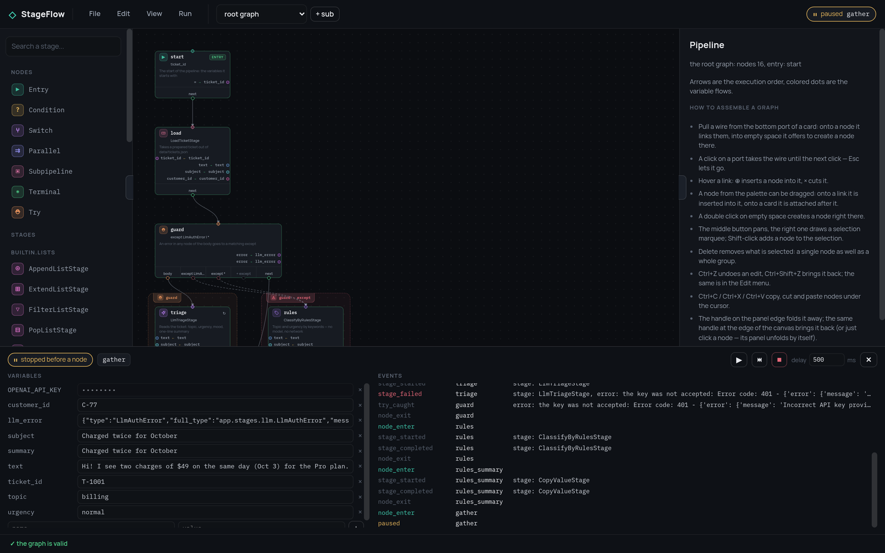
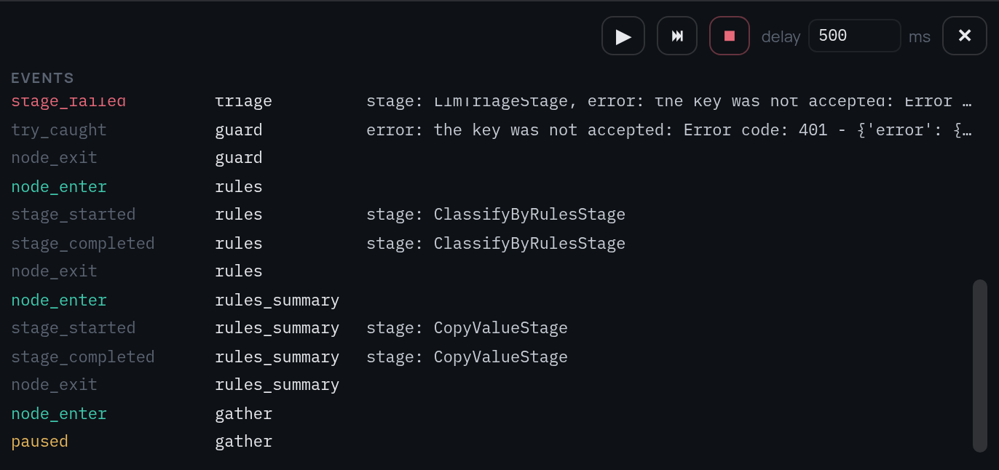

# Пошаговая отладка

`Session` принимает отладчик, получающий управление перед каждым узлом и после
него. Реализация в ядре — `StepDebugger`.

```python
from stageflow import Pipeline, Session, StepDebugger

debugger = StepDebugger(mode="step", delay=0.0, on_event=print)
session = Session("s1", Pipeline.from_dict(data), debugger=debugger)
task = asyncio.create_task(session.run())   # остановка перед первым узлом

debugger.step()                  # пустить один узел и снова встать
debugger.set_vars({"n": 42})     # применится перед следующим узлом
debugger.set_delay(0.5)          # идти самостоятельно с паузой между узлами
debugger.resume()                # дальше без остановок
result = await task
```

Снаружи доступны точка остановки (`debugger.node`), фрейм в ней
(`debugger.vars`) и поток событий `on_event`: `node_enter`, `node_exit`,
`paused`, `var_set`, `var_rejected`. Правка фрейма проверяется объявленными
типами — расхождение отвергается событием, а не падением сессии.

Отладчик работает и в теле `try`, и в ветках `parallel`, и в субпайплайне:
все узлы проходят через `Session.execute_node`, дочерняя сессия наследует
отладчик. Команды потокобезопасны.


[Редактор](tutorial/7-debugger.ru.md) — это фронтенд ровно к этому: он
останавливается между узлами, слева показывает фрейм, справа — поток событий.




