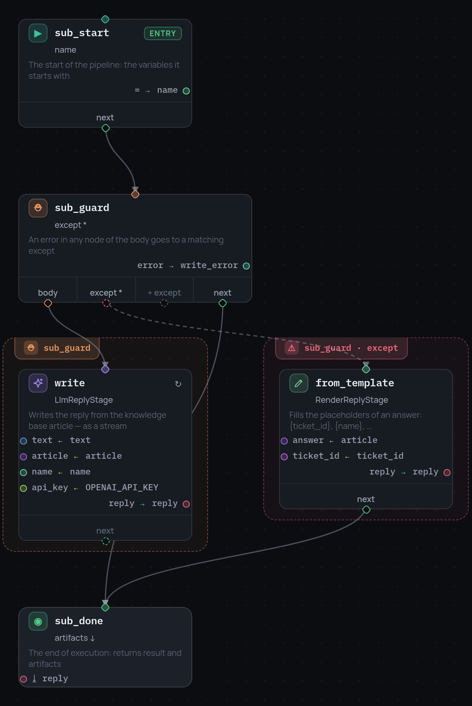

# Узел subpipeline

Целый граф за одной карточкой. Ребёнок исполняется в своей сессии со
**свежим фреймом**: через границу не проходит ничего, что не названо явно.

```json
{
  "id": "write_reply",
  "type": "subpipeline",
  "subpipeline_id": "reply",
  "inputs": { "topic": "topic", "text": "ticket_text" },
  "artifact_outputs": { "reply": "answer" },
  "result_output": "reply_status",
  "next": "send"
}
```

Дочерний граф объявляется в шапке пайплайна, рядом с `nodes`:

```json
{
  "entry": "start",
  "nodes": [ … ],
  "subpipelines": {
    "reply": {
      "entry": "compose",
      "nodes": [
        { "id": "compose", "type": "stage", "stage": "TemplateStage",
          "arguments": { "const": { "template": "About {topic}: we are on it" },
                         "vars": { "topic": "topic" } },
          "outputs": { "value": "answer" }, "next": "done" },
        { "id": "done", "type": "terminal",
          "result": { "status": "written" }, "artifacts": ["answer"] }
      ]
    }
  }
}
```

{ width="657" }

## Что пересекает границу

| Поле | Направление | Читается как |
|---|---|---|
| `inputs` | внутрь | `{ "имя внутри ребёнка": "переменная родителя" }` |
| `artifact_outputs` | наружу | `{ "переменная родителя": "артефакт ребёнка" }` |
| `result_output` | наружу | одна переменная ← `result` терминала ребёнка |

Обратите внимание, что направления записаны зеркально друг другу: имя
**ребёнка** в `inputs` стоит ключом, а в `artifact_outputs` — значением.
Правило за этим простое: переменная родителя всегда с той стороны, куда
движется значение.

Всё остальное остаётся на своих местах. Ребёнок не видит фрейм родителя, а
запись внутри ребёнка снаружи невидима, если его терминал не отдал её
артефактом.

## Остальной контракт

- Артефакт, который запросили, а ребёнок не вернул, — это
  `ArtifactNotFoundError` с перечислением того, что он вернул: как и у
  пропущенного выхода стадии, падение происходит в месте причины.
- [Объявления типов](variable-typing.ru.md) родителя наследуются ребёнком,
  если у того нет своих, — `ticket_id` значит одно и то же по обе стороны.
  Карта `subpipelines` тоже передаётся вниз: ребёнок может сам содержать узел
  subpipeline.
- События ребёнка попадают в поток родителя, каждое с пометкой
  `subpipeline_node: "<id>"`, а идентификатор сессии — `родитель:узел`:
  вложенный прогон читается в журнале и не путается с внешним.
- [Отладчик](step-debugging.ru.md) тоже наследуется: пошаговое исполнение
  заходит внутрь ребёнка по узлам, а не перепрыгивает его одним шагом.
- И [политика](policy.ru.md), и [бюджет](limits.ru.md) — иначе ребёнок со
  своим разрешением был бы лазейкой мимо обоих. Дочерний граф валидируется
  политикой при создании своей сессии, а счётчики, которые он двигает, —
  родительские.
- `retry` на узле повторяет весь дочерний прогон целиком.
- Идентификатор должен быть ключом `subpipelines` и не может совпадать с
  идентификатором корневого узла entry — валидация скажет это до запуска.

!!! warning "Рекурсия ничем не ограничена"
    Раз ребёнок наследует ту же карту `subpipelines`, субпайплайн, ссылающийся
    на себя, будет открывать дочерние сессии, пока не кончится стек. Предела
    глубины в ядре нет: рекурсивному графу нужно собственное условие
    остановки — `condition` по переменной глубины, переданной через `inputs`.
