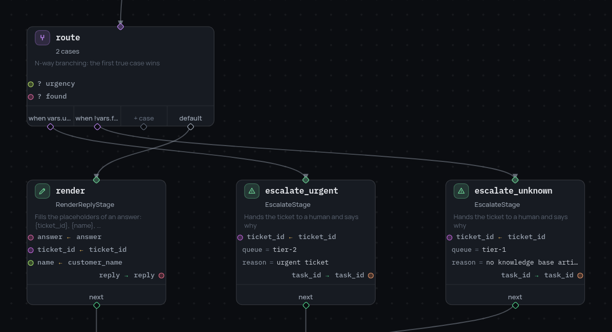

# The switch node

Many roads out of one node. The cases are tried **in the order they are
written** and the first true one wins; `default` catches everything else.

```json
{
  "id": "route",
  "type": "switch",
  "cases": [
    { "when": "vars.urgency == 'high'", "next": "page_a_human" },
    { "when": "vars.topic == 'billing'", "next": "to_billing" },
    { "when": "vars.topic == 'login'", "next": "to_support" }
  ],
  "default": "to_general"
}
```

{ width="598" }

- Every case needs both `when` (a [CEL expression](expressions.md)) and
  `next`; a case missing either is a validation error.
- Order is the priority. In the example above an urgent billing ticket goes to
  a human, because that case is written first — reorder the list and the same
  ticket goes to billing.
- `default` is optional, and a `switch` writes nothing to the frame.
- The `switch_evaluated` event records which expression won and where it led:
  `{"matched": "vars.topic == 'billing'", "next": "to_billing"}`. When nothing
  matched, `matched` is `null`.

## switch or condition?

Two exits are a [`condition`](condition-node.md) — `then`/`else` reads better
than two cases and one of them negated. Use a `switch` from three roads
onwards, or when the cases are a list that will grow: adding a topic is then
one more line, not another nested fork.

## When nothing matches

With no matching case and no `default` the run ends where it stands — no
[`terminal`](terminal-node.md) is reached, so the session returns
`result = null` and no artifacts. A `default` leading to a terminal that says
"unrecognised" is almost always better than a graph that quietly stops.
