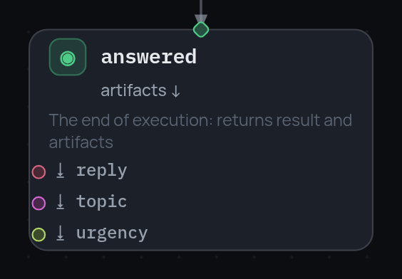

# Узел terminal

Конец прогона и единственный узел, который говорит, ради чего прогон был: что
он возвращает и какие переменные уходят из фрейма артефактами.

```json
{
  "id": "answered",
  "type": "terminal",
  "result": { "status": "answered", "channel": "email" },
  "artifacts": ["reply", "topic", "urgency"]
}
```

{ width="282" }

Сессия, дошедшая до него, ровно это и возвращает:

```python
result = await session.run()
result.result             # {"status": "answered", "channel": "email"}
result.artifacts["reply"] # значение vars.reply на этот момент
```

- `result` отдаётся как написан — обычный словарь вашей формы, ядро его не
  интерпретирует. По нему вызывающая сторона и различает исходы, так что его
  стоит писать так, чтобы он говорил, *какой* это конец, а не просто «готово».
- `artifacts` называет переменные, которые надо вычитать из фрейма. Имя,
  которого во фрейме нет, даёт `null`, а не ошибку — терминал не место, где
  выясняют пропажу значения, и такой `null` легко прочитать как «стадия
  ничего не вернула». Пишите имена, которые граф действительно производит.
- У терминала нет `next`: это конец дороги, и терминалов в графе может быть
  столько, сколько у него исходов.
- `expose` применяется до снятия результата, поэтому переменную, переименованную
  там же, можно тем же узлом и отдать.

## Завершение изнутри блока

Терминал завершает **весь прогон**, где бы он ни стоял — внутри тела
[`try`](errors.ru.md), в ветке [`parallel`](parallel-branches.ru.md), в теле
цикла [`map`](map-node.ru.md). Объемлющий узел продолжить не успевает: блок
видит, что сессия закончилась, и останавливается вместе с ней, так что `map`
на третьем элементе там и встанет.

Именно это делает ранний выход выразимым — страж, который видит закрытый
тикет и завершает прогон на месте:

```json
{ "id": "closed", "type": "condition", "condition": "vars.status == 'closed'",
  "then": "nothing_to_do", "else": "work" },
{ "id": "nothing_to_do", "type": "terminal", "result": { "status": "skipped" } }
```

## Когда граф кончается без терминала

Не дойти до терминала вообще — законно, но молчаливо: `condition` без `else`,
`switch` без подходящего case, стадия без `next`. Сессия заканчивается с
`result = null` и без артефактов. Если дорога должна кончаться — дайте ей
терминал: тогда результат и есть разница между «закончилось вот так» и
«свалилось с графа».
