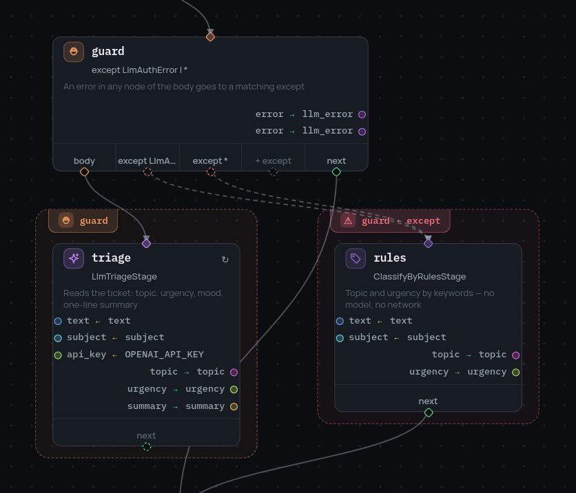

# Узел try

Обработка ошибок блочная: узел `try` накрывает область графа, и ошибка любого
узла внутри уходит в подходящий `except`.

```json
{
  "id": "safe_fetch",
  "type": "try",
  "body": "fetch",
  "except": [
    { "error_equals": ["TimeoutError"], "next": "on_timeout", "result_var": "error" },
    { "error_equals": ["*"], "next": "on_any" }
  ],
  "next": "after"
}
```

{ width="418" }

## Область выводится, а не перечисляется

Блок накрывает все узлы, достижимые из `body` и **не** достижимые из `next`, —
то же правило, по которому [цикл `map`](map-node.ru.md) определяет своё тело.
Так что блок задан формой графа: переставьте ребро — и защищённая область
изменится вместе с ним, и нет списка участников, который надо поддерживать
в согласии с графом.

Вложенные блоки работают как ожидается: внутренний `try` просто лежит в
области внешнего.

## Выбор обработчика

- `error_equals` принимает короткое имя класса исключения (`TimeoutError`),
  полный путь (`stageflow.exceptions.BranchError`) или `*`.
- Обработчики перебираются по порядку, побеждает первый подошедший, поэтому
  конкретные ставят выше `*`.
- Ошибка, под которую не подошёл никто, продолжает всплывать — к ближайшему
  внешнему блоку или наружу из сессии.
- `result_var` кладёт ошибку во фрейм объектом с полями `type`, `full_type`,
  `message` и `node`; последнее называет упавший узел — а это не сам блок.
  Падение глубже одной области названо тем узлом **из тела этого блока**,
  который его содержал: ошибка из вложенного `try` или из тела `map` назовёт
  этот вложенный узел, потому что именно он есть в графе, с которым работает
  обработчик.

Обработчик видит фрейм таким, каким его оставил **последний успешно
завершившийся узел тела**: записи, сделанные до падения, на месте, записей
упавшего узла нет.

## Куда ведёт дорога внутри блока

Дорога, которая просто кончилась (`"next": null`), возвращает управление
блоку, и тот продолжает со своего `next`. Это верно и для тела, и для
обработчика: обработчик — часть блока, а не выход из него.

Дорога может и уйти из блока насовсем, указав на узел, которым блок не
владеет, — тогда блок перестаёт ею владеть. (Это единственное место, где
`try` и `map` расходятся: [цикл](map-node.ru.md) такую дорогу запрещает,
потому что уход посреди итерации бросил бы оставшиеся элементы.)

[`terminal`](terminal-node.ru.md) внутри блока завершает весь прогон, и
ничего после блока не исполняется.

## Порядок восстановления

Сначала исчерпываются собственные политики [`retry`](errors.ru.md) упавшего
узла, и только потом ошибка всплывает к ближайшему `try`. Повтор — свойство
операции, перехват — свойство области; они складываются, а не конкурируют.
