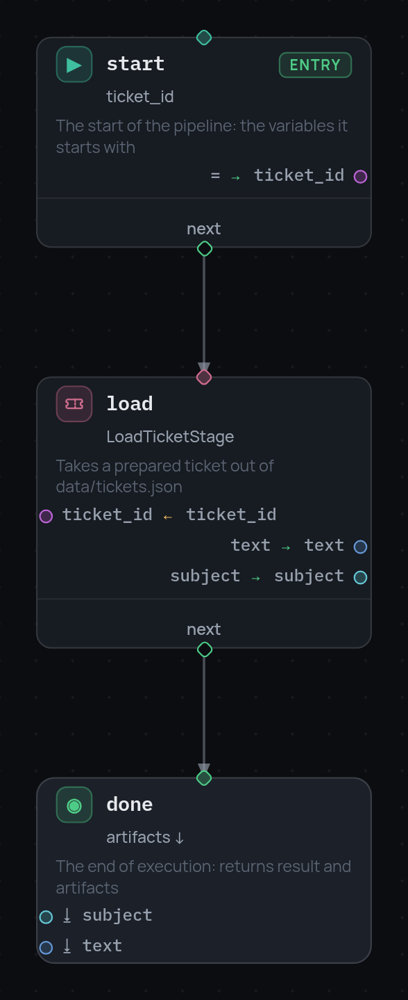

# 1. Первый запуск

Пайплайн — это JSON. В нём перечислены узлы и указано, какой узел за каким
идёт. Сама работа происходит в стадиях: это классы на Python, которые вы
пишете и регистрируете по имени.

## Стадия

Стадия делает одно дело. Вот эта читает тикет из JSON-файла:

```python
import json
from pathlib import Path

from stageflow import BaseStage, register_stage

DATA = Path(__file__).parent / "data"


@register_stage("LoadTicketStage")
class LoadTicketStage(BaseStage):
    """
    description: "Takes a prepared ticket out of data/tickets.json"
    arguments:
      ticket_id:
        type: string
        optional: true
        description: "Ticket id (T-1001); empty — the first one in the file"
    outputs:
      text:
        type: string
        description: "The customer's message"
      subject:
        type: string
        description: "The subject line"
      customer_id:
        type: string
        description: "Who wrote it"
    """

    async def run(self):
        wanted = (self.get_arguments().get("ticket_id") or "").strip()
        tickets = json.loads((DATA / "tickets.json").read_text())["tickets"]
        ticket = next((t for t in tickets if t["id"] == wanted), tickets[0])
        self.set_outputs({
            "text": ticket["text"],
            "subject": ticket["subject"],
            "customer_id": ticket["customer_id"],
        })
```

Здесь важны две вещи.

Докстринг — не комментарий, а спецификация стадии: что она принимает, что
возвращает и что редактору рисовать. Ядро разбирает его и по нему же проверяет
пайплайн до запуска. Всё, что туда можно положить, — на странице
[спецификации стадии](../stage-specification.ru.md).

`get_arguments()` возвращает то, что передал узел, а `set_outputs()` — то, что
стадия наработала. Сама стадия к переменным пайплайна не обращается: какая
переменная попадёт в какой аргумент, решает узел.

## Пайплайн

Три узла: откуда начать, что сделать, где остановиться.

```json
{
  "nodes": [
    {"id": "start", "type": "entry", "variables": {"ticket_id": "T-1001"}, "next": "load"},

    {"id": "load", "type": "stage", "stage": "LoadTicketStage",
     "arguments": {"vars": {"ticket_id": "ticket_id"}},
     "outputs": {"text": "text", "subject": "subject"},
     "next": "done"},

    {"id": "done", "type": "terminal", "result": {"status": "loaded"},
     "artifacts": ["subject", "text"]}
  ]
}
```

`entry` — точка старта и источник первых переменных. `stage` запускает вашу
стадию. `terminal` заканчивает запуск: `result` — это ответ, `artifacts` —
список переменных, которые стоит сохранить.

В `arguments.vars` ключ — имя аргумента, значение — переменная, откуда его
взять. В `outputs` наоборот: ключ — поле, которое вернула стадия, значение —
переменная, куда его записать.

## Запуск

```python
import asyncio

from stageflow import Context, Pipeline, Session

pipeline = Pipeline.from_dict(data)
pipeline.validate()          # id разрешаются, стадии есть, аргументы сходятся

result = asyncio.run(Session(id="run-1", pipeline=pipeline,
                             context=Context(vars={})).run())

print(result.result)         # {'status': 'loaded'}
print(result.artifacts)      # {'subject': 'Charged twice for October', 'text': 'Hi! I see two …'}
```

`validate()` стоит звать сразу. Он сверяет граф со спецификациями стадий, так
что опечатка в имени аргумента станет ошибкой до запуска, а не на середине
работы.

## Тот же граф в редакторе

{ width="294" }

Каждая карточка показывает узел с двух сторон. Над разделителем то, что он
читает (`ticket_id ← ticket_id`), под ним — то, что пишет (`text → text`).
Стрелка между карточками — это `next`.

Дальше: [данные между узлами](2-frame.ru.md).
