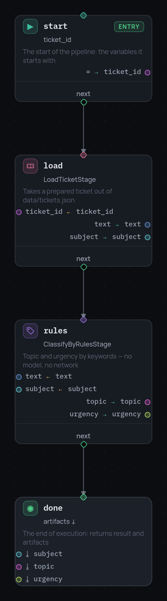

# 2. Data between nodes

Everything a run knows lives in one place: the frame. It is a dictionary of
variables that travels along the execution path. A node reads variables into
its arguments and writes its results back as variables.

The frame is immutable. A write does not change it, it produces a new one.
That is what makes [parallel branches](4-parallel.md) safe later on.

## Adding a second stage

The bot needs to know what the ticket is about. `ClassifyByRulesStage` decides
the topic and the urgency by keywords, without any network:

```json
{"id": "rules", "type": "stage", "stage": "ClassifyByRulesStage",
 "arguments": {"vars": {"text": "text", "subject": "subject"}},
 "outputs": {"topic": "topic", "urgency": "urgency"},
 "next": "done"}
```

It reads `text` and `subject`, both written by the loader in step 1, and adds
`topic` and `urgency` to the frame. Point `load.next` at it and let the
terminal report what came out:

```json
{"id": "done", "type": "terminal", "result": {"status": "classified"},
 "artifacts": ["subject", "topic", "urgency"]}
```

```python
result.result      # {'status': 'classified'}
result.artifacts   # {'subject': 'Charged twice for October', 'topic': 'billing', 'urgency': 'normal'}
```

{ width="294" }

## Arguments: variables and literals

Arguments come in two buckets. `vars` takes values from the frame, `const`
holds literals written into the JSON:

```json
"arguments": {
  "vars":  {"ticket_id": "ticket_id"},
  "const": {"queue": "tier-2", "reason": "no article matched"}
}
```

Both buckets can be used in the same node. If the same argument name appears
in both, the variable wins.

A node can also drop variables it was the last to need:

```json
"consume": ["text"]
```

After the node runs, `text` is gone from the frame. Nothing forces you to
clean up, but on a long graph it keeps the frame readable in the debugger.

## The node as a form

Click a node in the editor and the panel on the right shows the same thing the
docstring declared: what the stage gets, what it gives, which arguments are
optional.

{ width="372" }

Each argument has a switch between "variable" (take it from the frame) and
"expression" (compute it with CEL). The outputs at the bottom are the fields
the stage returns, each with the variable it goes into.

## Declaring types

Variables can be typed. The declaration is optional, and what you do not
declare is not checked:

```json
{
  "variables": {"ticket_id": "string", "topic": "string", "urgency": "string"},
  "nodes": [ ... ]
}
```

With that in place, `validate()` compares your declarations against the types
in the stage specifications. Declare `topic` as `int` and the pipeline stops
before it runs:

```
PipelineValidationError: Pipeline validation failed: rules: output 'topic' of
stage ClassifyByRulesStage has type 'string', but is written to vars.topic
typed 'int'
```

The same check runs again during execution for every write, so a stage that
returns something other than it promised is caught too. The full type language
is on the [variable typing](../variable-typing.md) page.

Next: [choosing the road](3-branching.md).
