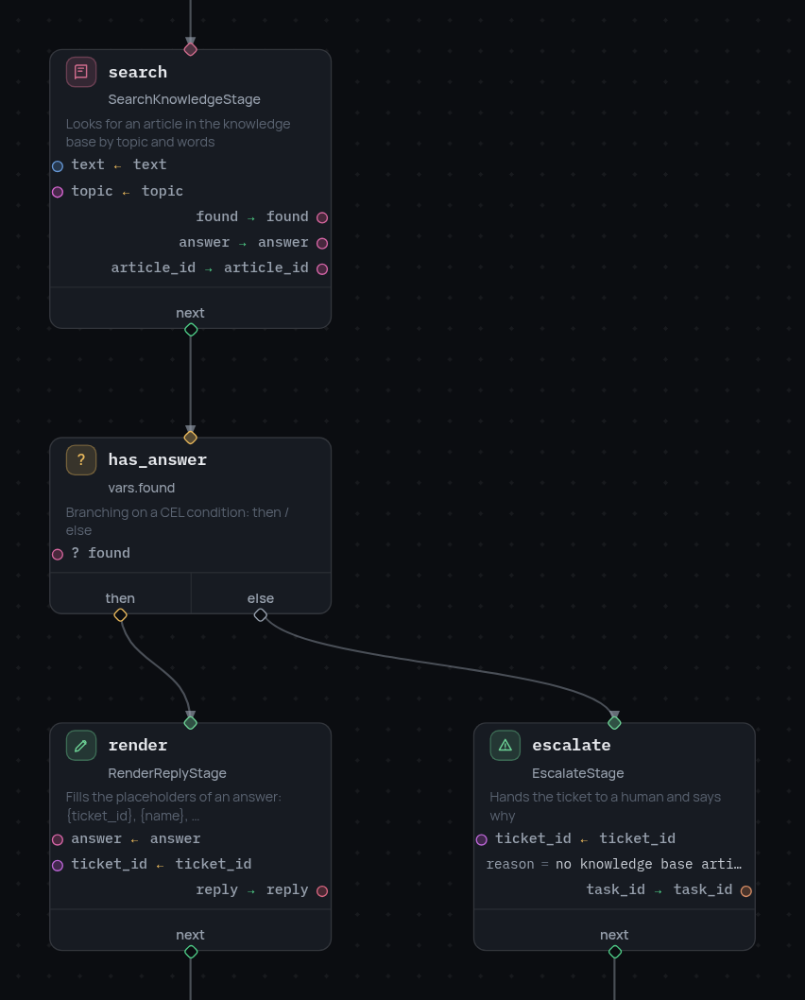
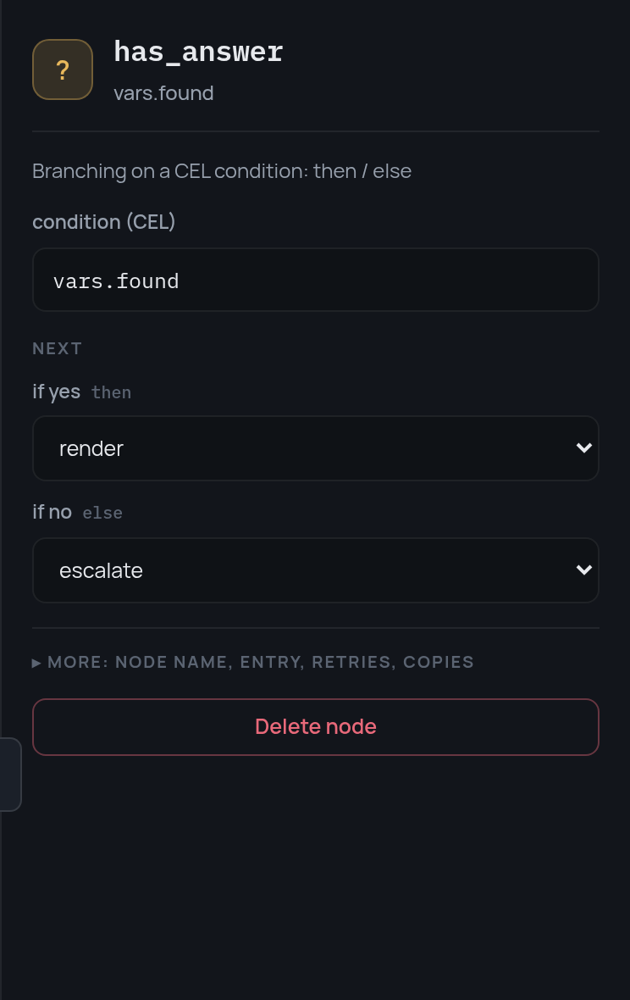

# 3. Choosing the road

So far the graph is a line. Now it has to decide: if the knowledge base has an
answer, write a reply; if not, give the ticket to a person.

## Looking for an answer

`SearchKnowledgeStage` searches the articles by topic and words. It reports
whether it found anything:

```json
{"id": "search", "type": "stage", "stage": "SearchKnowledgeStage",
 "arguments": {"vars": {"text": "text", "topic": "topic"}},
 "outputs": {"found": "found", "answer": "answer", "article_id": "article_id"},
 "next": "has_answer"}
```

## The fork

A `condition` node is one expression and two roads:

```json
{"id": "has_answer", "type": "condition", "condition": "vars.found",
 "then": "render", "else": "escalate"}
```

The expression is [CEL](../expressions.md). Frame variables live in the `vars`
namespace, so `vars.found` is the variable the search stage just wrote. You
can write anything CEL allows: `vars.urgency == 'high'`, `size(vars.tags) > 0`,
`vars.plan in ['pro', 'enterprise']`.

{ width="426" }

The panel for a condition node has one field for the expression and two for
where to go:

{ width="372" }

## Two endings

Each road ends in a terminal of its own, and the terminal that was reached is
the result of the run:

```json
{"id": "answered", "type": "terminal", "result": {"status": "answered"},
 "artifacts": ["reply", "article_id", "topic"]},

{"id": "handed_over", "type": "terminal", "result": {"status": "escalated"},
 "artifacts": ["task_id", "topic"]}
```

Between the fork and the endings sit three more stages: `render` fills the
placeholders in the article, `send` sends the reply, `escalate` creates a task
for a person.

## What it does now

Two tickets, two roads:

```python
# ticket_id = "T-1001", a double charge; the knowledge base has an article
{'status': 'answered'}    artifacts: reply, article_id, topic

# ticket_id = "T-1005", a feature request; nothing matches
{'status': 'escalated'}   artifacts: task_id, topic
```

The run reports each decision as an event, so you never have to guess which
road was taken:

```
condition_evaluated  {"result": true,  "next": "render"}
condition_evaluated  {"result": false, "next": "escalate"}
```

Next: [two things at once](4-parallel.md).
