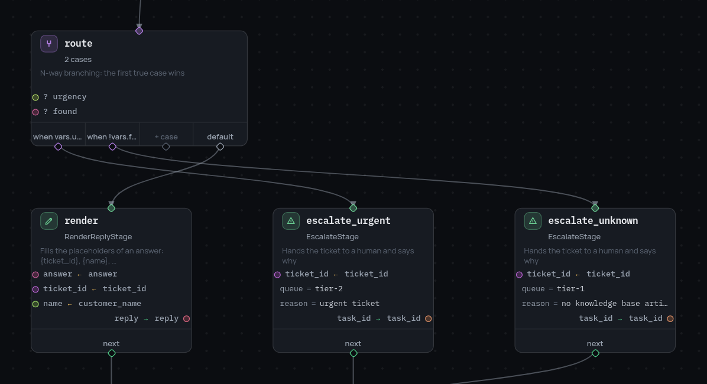

# 4. Два дела сразу

Две вещи, которые нужны боту, друг от друга не зависят: кто такой клиент и что
говорит база знаний. Делать их по очереди незачем.

## Ветки

Узел `parallel` перечисляет ветки. Ветка — это id входного узла; она работает
оттуда, пока её дорога не кончится:

```json
{"id": "gather", "type": "parallel",
 "branches": [{"id": "who", "entry": "customer"},
              {"id": "kb",  "entry": "search"}],
 "next": "route"}
```

```json
{"id": "customer", "type": "stage", "stage": "LoadCustomerStage",
 "arguments": {"vars": {"customer_id": "customer_id"}},
 "outputs": {"name": "customer_name", "plan": "plan"},
 "next": null},

{"id": "search", "type": "stage", "stage": "SearchKnowledgeStage",
 "arguments": {"vars": {"text": "text", "topic": "topic"}},
 "outputs": {"found": "found", "answer": "answer", "article_id": "article_id"},
 "next": null}
```

`"next": null` заканчивает ветку. Когда закончились все, исполнение идёт
дальше с `next` самого узла `parallel`.

{ width="418" }

## Что возвращается обратно

Каждая ветка получает свою копию фрейма, поэтому помешать друг другу ветки не
могут. Когда они заканчиваются, обратно вливаются только те имена, которых до
узла `parallel` не было:

```
parallel_completed  {"merged": ["answer", "article_id", "customer_name", "found", "plan"],
                     "dropped": []}
```

Если ветка перезаписала имя, которое уже существовало, эта запись остаётся
внутри ветки. Если две ветки пишут одно и то же новое имя — это ошибка
(`BranchError`), и в ней названы обе.

Когда ветка падает, остальные по умолчанию отменяются, а узел завершается той
же ошибкой. С `"cancel_on_error": false` соседние ветки сначала доигрывают.
Подробности — на странице
[параллельных веток](../parallel-branches.ru.md).

## Больше двух дорог

У бота теперь три исхода: срочные тикеты сразу уходят человеку, безответные —
в другую очередь, остальные получают ответ. `condition` даёт две дороги,
поэтому берём `switch`:

```json
{"id": "route", "type": "switch",
 "cases": [{"when": "vars.urgency == 'high'", "next": "escalate_urgent"},
           {"when": "!vars.found",            "next": "escalate_unknown"}],
 "default": "render"}
```

Случаи проверяются по порядку, побеждает первый истинный. `default` — куда
уходит всё остальное.

{ width="598" }

Запуск сообщает, какой случай сработал:

```
switch_evaluated  {"matched": null, "next": "render"}                       # T-1001
switch_evaluated  {"matched": "!vars.found", "next": "escalate_unknown"}    # T-1005
```

Дальше: [когда узел падает](5-errors.ru.md).
