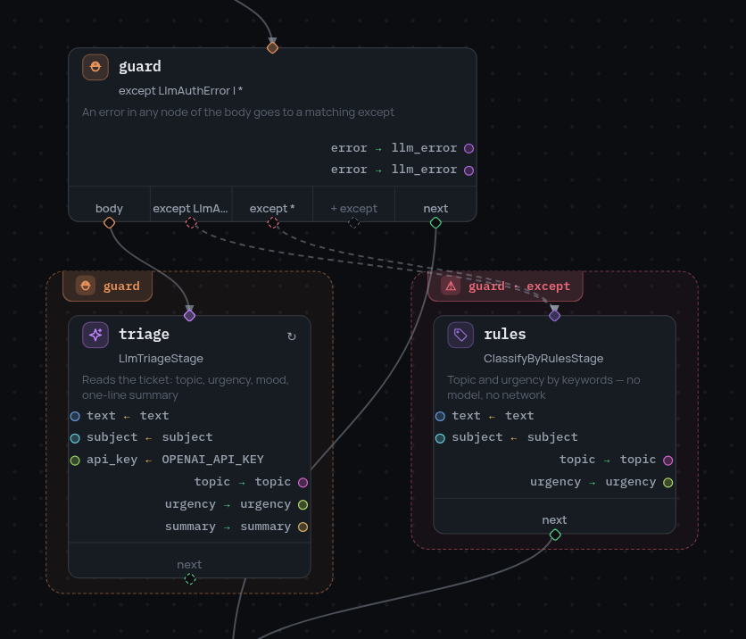

# 5. Когда узел падает

Правила по ключевым словам надёжны, но туповаты. Языковая модель читает тикет
лучше: она поймёт и тему, и срочность, и настроение. А ещё она может быть
недоступна, упереться в лимит или отказать из-за отсутствия ключа.

Это не повод писать `try` в Python. Падение здесь — такая же развилка в графе,
как любая другая: не смогла модель — идём на правила.

## Retry принадлежит узлу

Часть падений имеет смысл просто повторить. Например, лимит запросов:

```json
{"id": "triage", "type": "stage", "stage": "LlmTriageStage",
 "arguments": {"vars": {"text": "text", "subject": "subject", "api_key": "OPENAI_API_KEY"}},
 "outputs": {"topic": "topic", "urgency": "urgency", "summary": "summary"},
 "retry": [{"error_equals": ["LlmRateLimited", "LlmUnavailable"],
            "max_attempts": 3, "interval_seconds": 2}]}
```

`max_attempts` считает и первый запуск, поэтому `3` — это одна попытка и два
повтора. `retry` может нести любой узел, не только `stage`.

## Try накрывает область

Узел `try` оборачивает не один узел, а кусок графа: всё, что достижимо из
`body`, но не достижимо из `next`.

```json
{"id": "guard", "type": "try", "body": "triage", "next": "gather",
 "except": [{"error_equals": ["LlmAuthError"], "next": "rules", "result_var": "llm_error"},
            {"error_equals": ["*"],            "next": "rules", "result_var": "llm_error"}]}
```

`error_equals` принимает имя класса, полный путь или `*` — «что угодно».
`result_var` кладёт ошибку во фрейм объектом с полями `type`, `full_type`,
`message` и `node`, так что следующий узел может посмотреть, что случилось.

{ width="418" }

Редактор обводит обе области: тело — вокруг `triage`, обработчик — вокруг
`rules`.

## Обработчик должен сказать, куда идти

Тело и обработчик заканчиваются по-разному, и на этом легко споткнуться.

Дорога тела, кончающаяся `"next": null`, возвращается на `next` узла `try`.
Дорога обработчика, кончающаяся `"next": null`, вместо этого завершает весь
запуск. Поэтому последний узел обработчика обязан назвать, куда идти дальше:

```json
{"id": "rules", "type": "stage", "stage": "ClassifyByRulesStage",
 "arguments": {"vars": {"text": "text", "subject": "subject"}},
 "outputs": {"topic": "topic", "urgency": "urgency"},
 "next": "gather"}
```

## Как это выглядит, когда срабатывает

Запустите бота без рабочего ключа. Стадия с моделью падает, обработчик её
ловит, дальше работают правила:

```
stage_failed  triage  stage: LlmTriageStage, error: no OpenAI API key …
try_caught    guard   type: LlmAuthError, next: rules
node_enter    rules
```

Путь запуска от старта до ответа:

```
start → load → guard → triage → rules → gather → customer → search → route → render → send → answered
```

Результат тот же `{'status': 'answered'}`, что и раньше. Бот потерял только
прочтение тикета моделью и продолжил работать.

Дальше: [граф внутри узла](6-subpipelines.ru.md).
