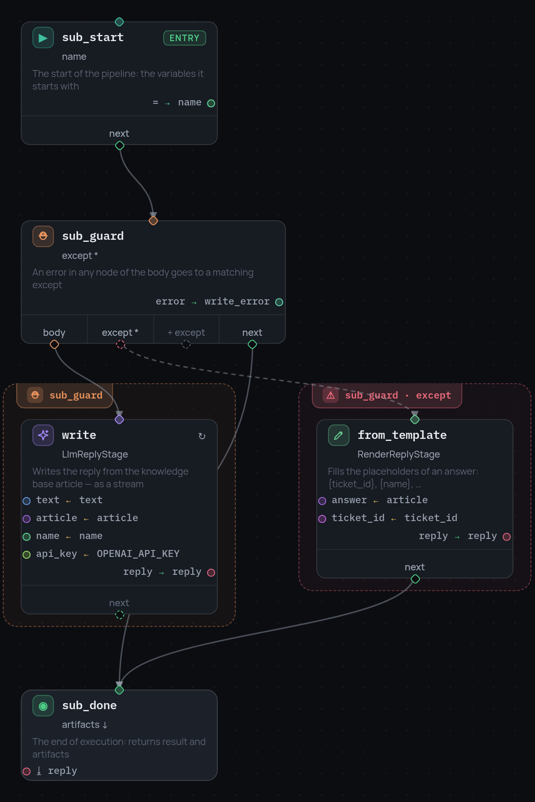

# 6. Граф внутри узла

Написать ответ — это отдельная небольшая задача: попросить модель, а если не
вышло, подставить значения в шаблон статьи. У неё свой try/except, свои шаги,
и всему остальному боту их видеть незачем.

Узел `subpipeline` держит это отдельным графом.

## Узел

```json
{"id": "compose", "type": "subpipeline", "subpipeline_id": "compose_reply",
 "inputs": {"text": "text", "article": "answer",
            "name": "customer_name", "ticket_id": "ticket_id"},
 "artifact_outputs": {"reply": "reply"},
 "next": "send"}
```

Сами графы лежат рядом с `nodes`, в секции `subpipelines`:

```json
{
  "nodes": [ ... ],
  "subpipelines": {
    "compose_reply": {
      "nodes": [
        {"id": "sub_start", "type": "entry", "variables": {"name": "there"}, "next": "sub_guard"},
        {"id": "sub_guard", "type": "try", "body": "write", "next": "sub_done",
         "except": [{"error_equals": ["*"], "next": "from_template", "result_var": "write_error"}]},
        {"id": "write", "type": "stage", "stage": "LlmReplyStage", "...": "..."},
        {"id": "from_template", "type": "stage", "stage": "RenderReplyStage", "...": "..."},
        {"id": "sub_done", "type": "terminal", "artifacts": ["reply"]}
      ]
    }
  }
}
```

{ width="657" }

## Фрейм не общий

Субпайплайн стартует с чистым фреймом. `inputs` — это всё, что он получает:
слева имя внутри дочернего графа, справа переменная родителя. Больше из
родителя не видно ничего.

В этом и смысл узла. Дочерний граф не может случайно прочитать или затереть
переменную родителя, а один и тот же граф можно вызывать из нескольких мест,
не думая о совпадении имён.

Результаты возвращаются так же. `artifact_outputs` связывает артефакт
терминала дочернего графа с переменной родителя, а `result_output` кладёт весь
`result` дочернего запуска в одну переменную.

!!! note

    В примере внутрь передаются `text`, `article`, `name` и `ticket_id`, но не
    `OPENAI_API_KEY`. Поэтому у стадии с моделью внутри субпайплайна ключа
    нет, и она всегда уходит на шаблон. Добавьте это имя в `inputs`, если
    хотите, чтобы дочерний граф тоже пользовался ключом.

## В редакторе

Субпайплайн — отдельный граф, и редактор показывает его именно так.
Выпадающий список рядом с «root graph» в тулбаре переключает между главным
графом и субпайплайнами, а «+ sub» создаёт новый.

Дальше: [смотрим, как он работает](7-debugger.ru.md).
