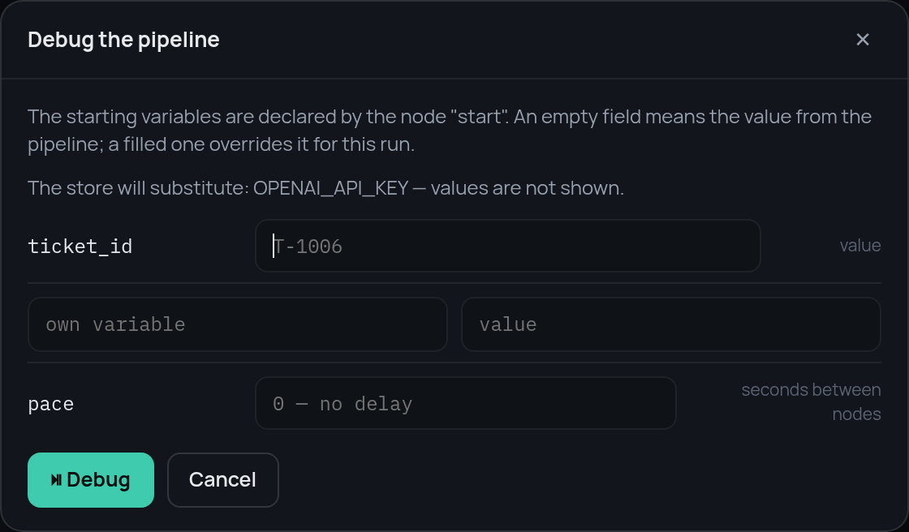
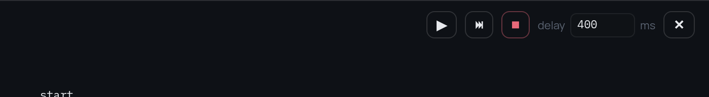
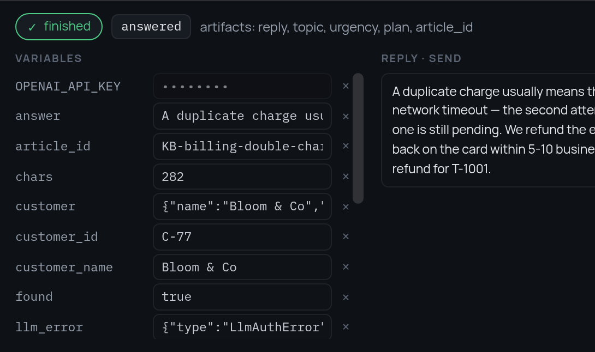
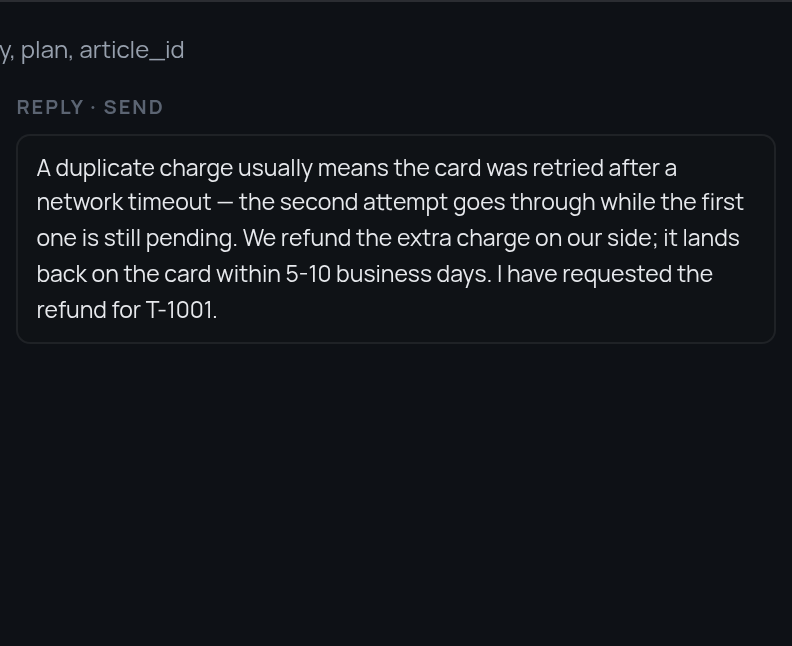
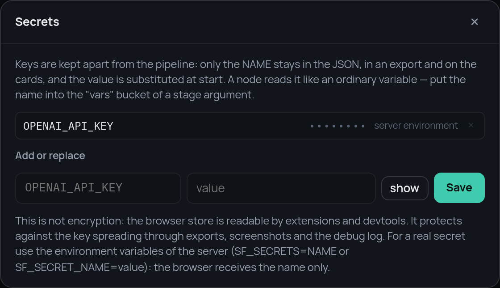

# 7. Watching it run

The graph is finished. The last piece is seeing it work: which node is running,
what is in the frame, which road a decision took.

The core has a step debugger, and the editor is a front end for it. Both stop
between nodes, show the frame and let you change it.

## From Python

```python
from stageflow import Pipeline, Session, StepDebugger

debugger = StepDebugger(mode="step", delay=0.0, on_event=print)
session = Session("run-1", Pipeline.from_dict(data), debugger=debugger)
task = asyncio.create_task(session.run())   # stops before the first node

debugger.step()                  # one node, then stop again
debugger.set_vars({"ticket_id": "T-1006"})
debugger.resume()                # run to the end
result = await task
```

## In the editor

"Run" → "Debug step by step" asks for the starting variables first. The
defaults from the `entry` node are the placeholders; fill a field to override
it for this run only.

{ width="560" }

Then the run stops before the first node and waits.


The buttons are the debugger's commands: continue, one step, stop, and the
pause between nodes in milliseconds.



### The frame

On the left is the frame at the stop point, and every value is editable. A
write is applied before the next node and checked against the declared type; a
mismatch is rejected with a `var_rejected` event instead of breaking the run.

This is the quickest way to reach a road that is otherwise hard to trigger.
Stop the run before `route`, set `urgency` to `high`, and the ticket that was
about to be answered goes to a person instead.

### The events

On the right is everything the run reports: which node was entered and left,
which stage started and finished, which case a switch matched, which handler a
`try` used.


Three lines tell the whole story of step 5: the stage failed, the `try` caught
it, execution continued at `rules`.

### The result

A terminal ends the run. The head of the panel shows the result and the
artifacts, and the frame stays there to be read:

{ width="545" }

The middle column is a text stream. Any event whose payload looks like
`{"stream": true, "text": "…", "label": "…"}` is shown there, so a stage that
writes an answer piece by piece can be watched as it goes:

{ width="396" }

```python
self.emit("reply_chunk", {"stream": True, "text": word + " ", "label": "Reply"})
```

## Keys

The model stage needs an API key, and a key has no business being in a
pipeline JSON that gets exported and shared. Give it to the server instead:

```bash
SF_SECRET_OPENAI_API_KEY=sk-… python main.py
```

The editor asks the backend which secrets it has and gets names only. The
pipeline reads the name as an ordinary variable (`api_key ← OPENAI_API_KEY`),
the backend substitutes the value when the run starts, and everything on the
way back to the browser shows `••••••••` instead of it.

{ width="560" }

Keys typed into the editor itself live in the browser, not in the JSON, and
are sent with the run.

## That is the bot

Seven steps, and every node type has appeared: `entry`, `stage`, `condition`,
`switch`, `parallel`, `try`, `subpipeline`, `terminal`. The
[reference](../node-types.md) has the details of each, and the
[example repository](https://github.com/leo-need-more-coffee/stageflow-example)
has the finished pipelines, the stages and the data files.
