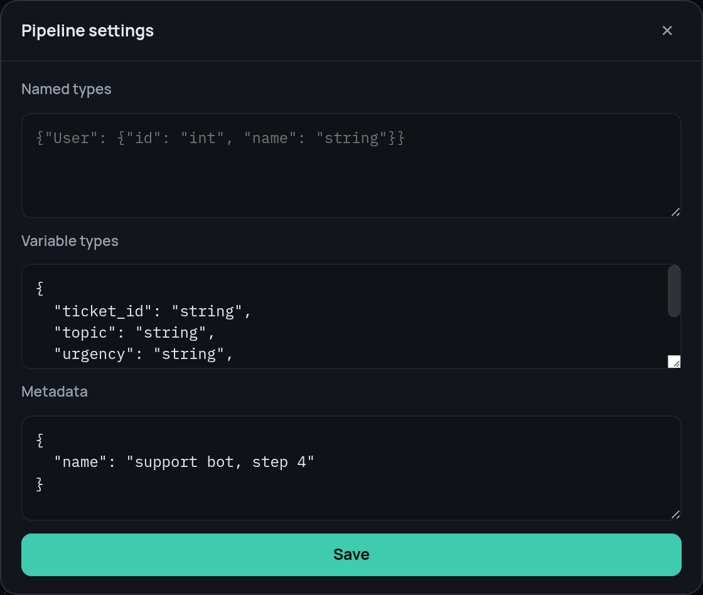

# Variable typing

Typing is gradual: an undeclared variable is not checked, and the type
sections are optional.

```json
{
  "types": {
    "UserId": "int",
    "User": {
      "id": "UserId",
      "name": "string",
      "email?": "string",
      "settings": { "theme": "string" }
    },
    "Point": { "fields": { "x": "int", "y": "int" }, "strict": true },
    "Tree":  { "value": "int", "children": "list<Tree>" }
  },
  "variables": { "user": "User", "attempts": "int", "tags": "list<string>" }
}
```

The type language: primitives `string`, `int`, `float`, `number` (int|float),
`bool`, `any`, `null`; containers `list<T>` and `map<T>` (string keys); unions
`T|U`; the shorthand `T?` for `T|null`; names from the `types` section.
Structures support optional fields (a `?` suffix on the name), nested
anonymous structures, recursion, and a strict mode (`strict` forbids extra
fields).

Checks come in two layers:

- statically, during graph validation: a variable's declared type is matched
  against the type hints in the stage specification, and `expose` requires the
  source and destination to be compatible; a mismatch is a
  `Pipeline.validate()` error raised before the run starts;
- dynamically, during execution: every write to a declared variable (`entry`,
  `outputs`, `expose`, `except.result_var`, subpipeline artifacts) and the
  session's input context are checked against the full structure of the value;
  a mismatch raises `TypeCheckError` carrying the node and the path to it.

A subpipeline inherits its parent's named types and may declare its own;
variable types are its own.

Both sections are editable in the editor, under "File" → "Pipeline settings…":

{ width="560" }

