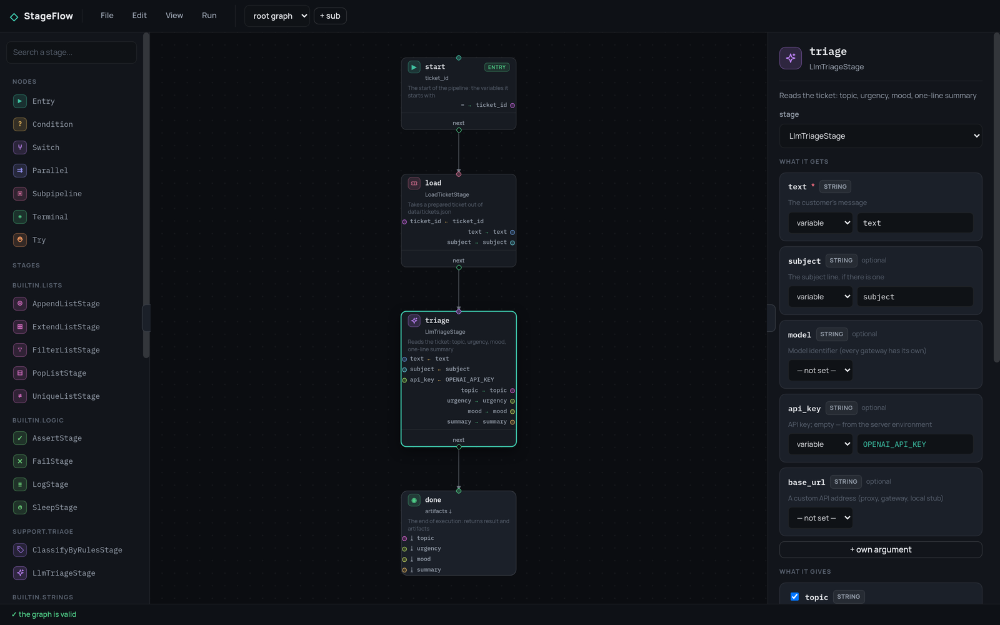
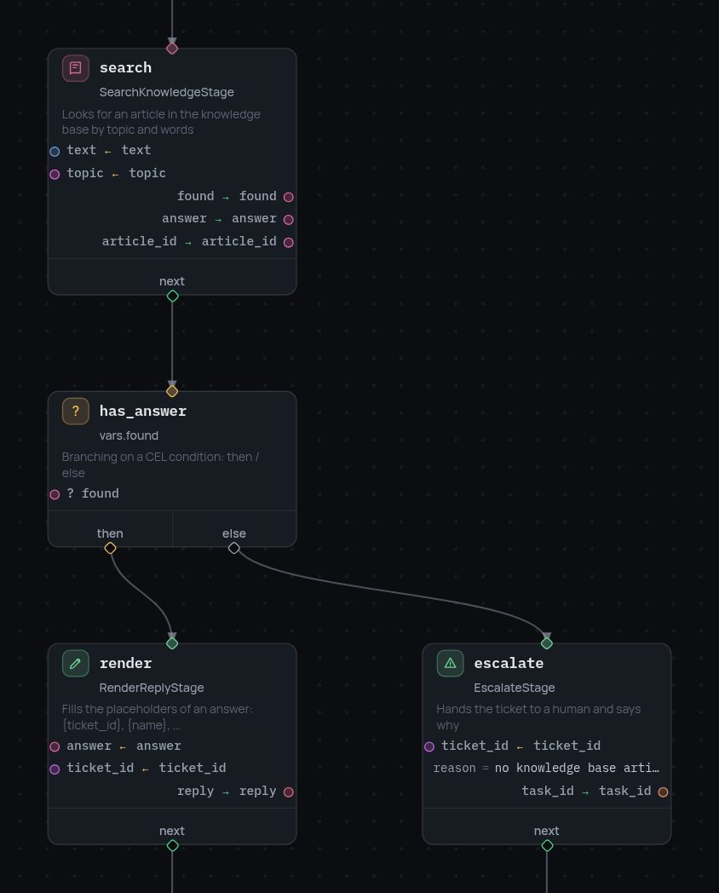
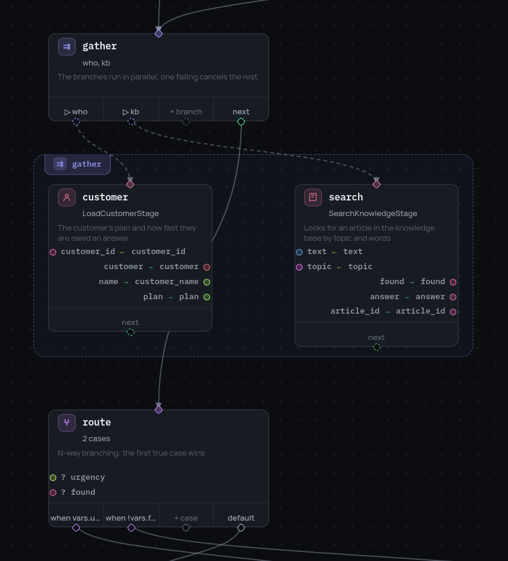
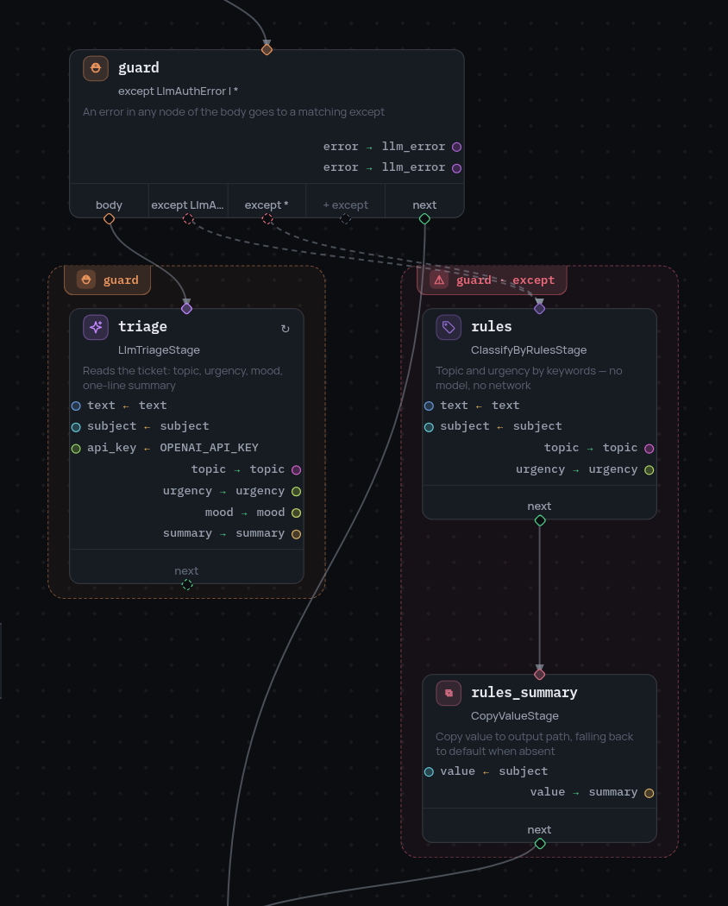
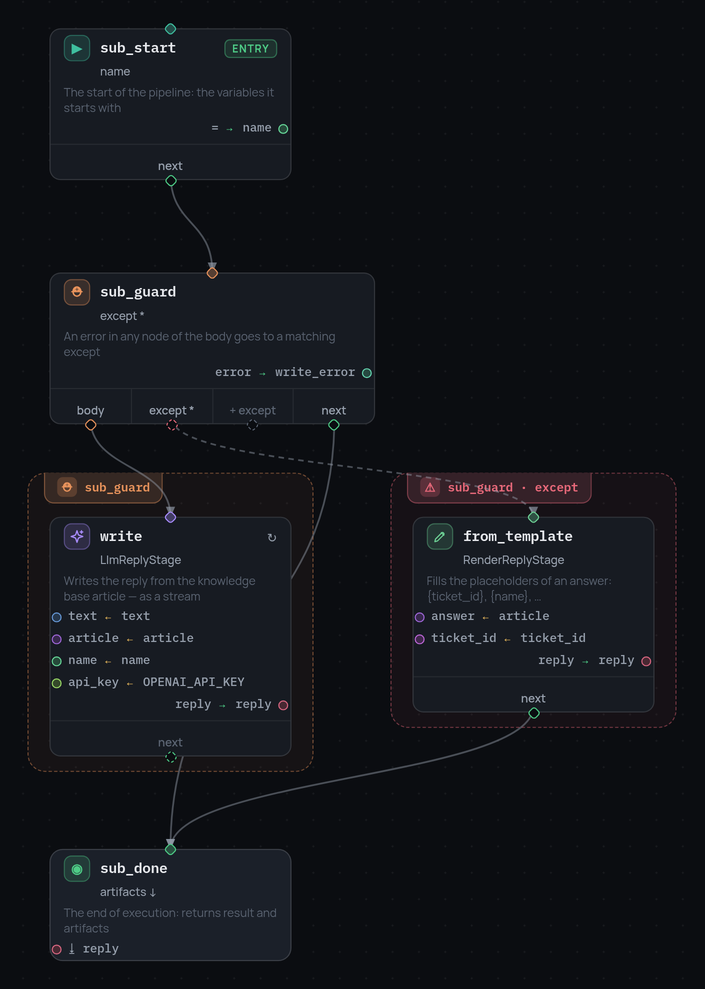

# Разбор примера: бот поддержки

Страницы справочника разбирают по одной вещи за раз. Здесь наоборот: один
рабочий пайплайн от JSON-файла до отладки по шагам — в визуальном редакторе и
на настоящем бэкенде.

Участвуют три репозитория:

| Репозиторий | Что это |
|---|---|
| [stageflow](https://github.com/leo-need-more-coffee/stageflow) | ядро: узлы, кадр, CEL, `retry`, `try`/`except`, параллельные ветки, подпайплайны |
| [stageflow-example](https://github.com/leo-need-more-coffee/stageflow-example) | бэкенд: стадии бота поддержки, четыре пайплайна, API запуска |
| [stageflow-ui](https://github.com/leo-need-more-coffee/stageflow-ui) | редактор: статический фронтенд, не хранит стадий и ничего не исполняет |

## Запуск обеих половин

Бэкенд — стадии и API запуска:

```bash
git clone https://github.com/leo-need-more-coffee/stageflow-example
cd stageflow-example
pip install -r requirements.txt
python main.py                 # http://127.0.0.1:8765
```

Редактор — статическая страница:

```bash
git clone https://github.com/leo-need-more-coffee/stageflow-ui
cd stageflow-ui
npm start                      # http://127.0.0.1:8080
```

Откройте редактор и введите `http://127.0.0.1:8765` на экране подключения
(`?backend=http://127.0.0.1:8765` в URL снимает вопрос). «File» → «Import
JSON…» открывает любой из пайплайнов из `pipelines/`.



Палитра слева — это то, что бэкенд ответил на `GET /api/stages`:
спецификации, которые ядро собирает из
[докстрингов стадий](stage-specification.md). Своего реестра у редактора нет,
и исполняет он тоже ничего — запуск происходит на бэкенде, в настоящей
`Session` с ядровым `StepDebugger`. Отладчик показывает саму семантику, а не
её второй реализацией на JavaScript.

## Прямая линия

`01-triage.json` — четыре узла: [`entry`](entry-node.md), две стадии и
[`terminal`](node-types.md).

```json
{"id": "start", "type": "entry", "variables": {"ticket_id": "T-1001"}, "next": "load"}
```

Узел `entry` — источник кадра: `ticket_id` здесь стартовая переменная, и
диалог запуска предложит её переопределить. Всё, что идёт дальше, читает и
пишет один и тот же [кадр](data-model.md) — отсюда и две половины у карточки:
`arg ← var` над разделителем, `out → var` под ним:

```json
{"id": "triage", "type": "stage", "stage": "LlmTriageStage",
 "arguments": {"vars": {"text": "text", "subject": "subject", "api_key": "OPENAI_API_KEY"}},
 "outputs": {"topic": "topic", "urgency": "urgency", "mood": "mood", "summary": "summary"}}
```

Панель справа — тот же узел в виде формы: что он получает, что отдаёт и какие
аргументы необязательны. Блок `variables` пайплайна объявляет
[типы](variable-typing.md): `topic` — строка, и узел, который запишет туда
число, будет отклонён ещё до запуска.

## Развилка

`02-auto-reply.json` добавляет поиск по базе знаний и первую развилку.



`condition` — это одно [CEL-выражение](expressions.md) и две дороги.
Выражение здесь — `vars.found`, его записала стадия поиска узлом раньше:

```json
{"id": "has_answer", "type": "condition", "condition": "vars.found",
 "then": "render", "else": "escalate"}
```

У каждой дороги свой терминал, и то, до какого дошли, и есть результат
запуска.

## Две ветки разом и N дорог

`03-routing.json` грузит клиента и ищет статью одновременно, а потом
маршрутизирует по тому, что вернулось.



Узел [`parallel`](parallel-branches.md) даёт ветвям имена, а редактор
обводит рамкой узлы, которые им принадлежат. Ветки идут одновременно, их
записи сливаются в один кадр, а падение одной отменяет остальные.

```json
{"id": "gather", "type": "parallel",
 "branches": [{"id": "who", "entry": "customer"}, {"id": "kb", "entry": "search"}],
 "next": "route"}
```

`switch` — это N дорог вместо двух: случаи проверяются по порядку, побеждает
первый истинный, а `default` — куда уходит всё, что не совпало ни с чем.

```json
{"id": "route", "type": "switch",
 "cases": [{"when": "vars.urgency == 'high'", "next": "escalate_urgent"},
           {"when": "!vars.found", "next": "escalate_unknown"}],
 "default": "compose"}
```

## Ошибки — тоже дороги

`04-support-bot.json` — тот же бот, но дорога через модель прикрыта. Стадии,
которая читает тикет, нужны ключ и сеть; и того и другого может не быть, и
это не исключение, которое надо напечатать, — это дорога на графе.



Узел [`try`](errors.md) обводит область: ошибка в любом узле тела уходит в
подходящий `except`, а сама ошибка попадает в кадр под именем из
`result_var`.

```json
{"id": "guard", "type": "try", "body": "triage", "next": "gather",
 "except": [{"error_equals": ["LlmAuthError"], "next": "rules", "result_var": "llm_error"},
            {"error_equals": ["*"], "next": "rules", "result_var": "llm_error"}]}
```

`LlmAuthError` означает «ключа нет или его не приняли», и дорога оттуда ведёт
в `ClassifyByRulesStage` — он определяет тему и срочность по ключевым словам
и не требует вообще ничего. Обработчик `*` — та же дорога для всего
остального.

То, что имеет смысл повторить, а не объехать, — это `retry`, и он
принадлежит узлу (отметка `↻` на карточке):

```json
"retry": [{"error_equals": ["LlmRateLimited", "LlmUnavailable"],
           "max_attempts": 3, "interval_seconds": 2}]
```

## Граф за одним узлом

Ответ пишет `subpipeline` — собственный граф со своим `entry`, своим `try` и
своим терминалом.



```json
{"id": "compose", "type": "subpipeline", "subpipeline_id": "compose_reply",
 "inputs": {"text": "text", "article": "answer", "name": "customer_name", "ticket_id": "ticket_id"},
 "artifact_outputs": {"reply": "reply"}, "next": "send"}
```

`inputs` — это всё, с чем стартует дочерний кадр: ничего другого из
родительского внутри не видно. `artifact_outputs` — то, что возвращается из
терминала дочернего графа. В редакторе подпайплайн — отдельный граф, он
выбирается в тулбаре рядом с «root graph».

## Запуск по одному узлу

«Run» → «Debug step by step» сначала спрашивает стартовые переменные.
Значения, объявленные узлом `entry`, стоят подсказками в полях; заполненное
поле переопределяет значение только для этого запуска.


Строка про хранилище — это про секреты (раздел ниже): редактор знает ИМЯ
`OPENAI_API_KEY` и никогда не знает значения.

Дальше сессия останавливается перед самым первым узлом и идёт по команде.


Слева — кадр в точке остановки, и каждое значение в нём можно править: запись
применяется перед следующим узлом и проверяется по объявленному типу, а
несовпадение отклоняется событием `var_rejected`, а не падением сессии.
Справа — поток событий запуска: `node_enter` / `node_exit`, `stage_started` /
`stage_completed`, `paused` и всё, что ядро сообщает о ветвлениях.

Этот запуск сделан с ключом, который API не принял, и лог говорит об этом
тремя строками: стадия упала, `try` поймал, исполнение продолжилось с
`rules`.


Это и есть дорога `except` — сразу и на графе, и в логе. Если ключа нет
вовсе, случится то же самое с сообщением `no OpenAI API key`: для графа оба
случая — `LlmAuthError`, и оба ведут к правилам по ключевым словам.

Кнопки — это команды отладчика: шаг, запуск с паузой между узлами (`delay`),
продолжить, остановить. То же самое из Python — на странице
[пошаговой отладки](step-debugging.md).

## Результат

Узел `terminal` заканчивает запуск результатом и списком артефактов — тех
переменных из всего кадра, которые стоит сохранить.

```json
{"id": "answered", "type": "terminal", "result": {"status": "answered"},
 "artifacts": ["reply", "topic", "urgency", "plan", "article_id"]}
```


Кадр, с которым запуск закончился, никуда не девается — в нём виден и
`llm_error`, по которому запуск, ушедший на резервную дорогу, отличается от
того, которому она не понадобилась.

Средняя колонка панели — текстовый поток:


Это не знание про конкретного бота. Туда попадает любое событие, у которого
payload выглядит как `{"stream": true, "text": "…", "label": "…"}`, поэтому
стадия, печатающая ответ, расшифровка речи и лог сборки приходят туда
одинаково:

```python
self.emit("reply_chunk", {"stream": True, "text": word + " ", "label": "Reply"})
```

## Секреты

Ключ отдают серверу, а не пайплайну:

```bash
SF_SECRET_OPENAI_API_KEY=sk-… python main.py
```

Редактор спрашивает `GET /api/secrets` и получает только имена. Пайплайн
читает имя как обычную переменную (`api_key ← OPENAI_API_KEY`), бэкенд
подставляет значение в стартовый кадр, а всё, что уходит обратно в браузер —
кадр, лог событий, аргументы стадий в телеметрии, — отдаётся с `••••••••`
вместо значения. Поэтому в отладчике выше ключ замаскирован, хотя стадия,
которая им пользовалась, видела настоящий.

## Что попробовать

Ситуации — это подготовленные данные в `data/`, они читаются на каждом
запуске, так что после правки ничего перезапускать не нужно.

| Стартовый `ticket_id` | Какой дорогой пойдёт граф |
|---|---|
| `T-1001` | двойное списание: статья находится, ответ пишется и отправляется — `{"status": "answered"}` |
| `T-1002` | не грузится дашборд: статья тоже находится, но `urgency == 'high'` — первый случай switch эскалирует |
| `T-1005` | запрос фичи: в базе знаний ничего не подходит, поэтому эскалирует `!vars.found` |

До дороги, которую иначе поймать трудно, — одна правка кадра: остановите
запуск перед `route`, поставьте `urgency` в `high`, и тот же тикет, на
который только что был написан ответ, уйдёт человеку.
